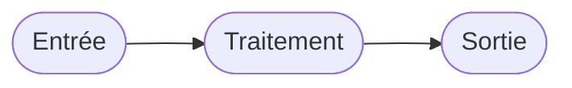

Crée une nouvelle page de type **Concept** dans `_docs/concepts/` pour ce site Jekyll MakerSpace.

Un concept explique un principe, une théorie ou un fonctionnement — pas une procédure. Il répond à « pourquoi » et « comment ça marche », pas à « comment faire ».

**Arguments attendus** : `$ARGUMENTS`
Format : `<slug>` — ex : `communication-i2c` ou `machine-etats-finis`

## Ce que tu dois faire

1. **Chemin** :
   - Fichier : `_docs/concepts/<slug>.md`
   - Dossier images : `_docs/concepts/<slug>/` (créer un `.gitkeep`)

2. **Front matter** :

```yaml
---
layout: documentation
hide_hero: false
hero_image: hero.png
hero_darken: true
image: hero.png
component_toc: true
doc_header: true
type: concept

title: <Titre du concept>
subtitle: <Accroche : ce que l'utilisateur va comprendre>
description: <1 phrase de résumé>
author: Alban Petit

time: 1
difficulty: 1
todo: 10

prerequisites:
  - label: Aucun pré-requis nécessaire
    link: ""
---
```

3. **Squelette de contenu** :

```markdown
## Introduction

Présente le contexte et l'intérêt du concept.

## Principe de fonctionnement

Explique le principe théorique. Utilise des schémas Mermaid si utile :



## Caractéristiques clés

Bullet points ou tableau des points importants à retenir.

## Exemples concrets

Illustre avec des cas du MakerSpace.

## Pour aller plus loin

- [Lien ressource externe](https://...)
```

4. **Rappels** :
   - Corps en `##`, pas de `#` dans le contenu.
   - Les formules mathématiques s'écrivent avec `$ ... $` (inline) ou `$$ ... $$` (bloc) — KaTeX est activé.
   - Les diagrammes s'écrivent en blocs ` ```mermaid! ``` ` — Mermaid est activé.
   - Pas de `time`/`difficulty` si c'est un cours pur (les laisser ou les retirer selon pertinence).

5. **Affiche** le chemin et le front matter final.
