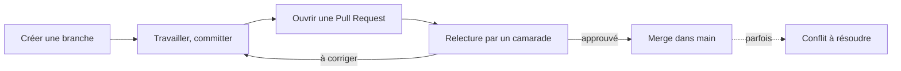

## Contexte



Ce guide combine deux compétences liées : proposer son travail via une
**Pull Request** pour qu'il soit relu avant d'atteindre la branche
principale, et résoudre un **conflit Git** — qui survient justement le
plus souvent au moment de fusionner une Pull Request.

## Prérequis

- Être à l'aise avec le cycle stage / commit / push de base — voir
  [Git, GitHub Desktop et VSCode](/workshops/methodologie-de-projet/tutorials/git-github-desktop-vscode/).

## Procédure

### 1. Pourquoi ne pas pousser directement sur `main`

Travailler directement sur la branche principale (`main`) fonctionne tant
qu'on est seul. À plusieurs, ça mène vite à des conflits et à du code non
relu qui casse ce qui marchait. Une **Pull Request** (PR) propose vos
modifications, les rend visibles avant qu'elles n'atteignent `main`, et
donne à quelqu'un d'autre l'occasion de les relire.



### 2. Créer une branche



### 3. Ouvrir la Pull Request



### 4. Relire le travail d'un camarade





### 5. Fusionner (merge)



### 6. Si un conflit apparaît

Un conflit survient quand deux personnes ont modifié **les mêmes lignes**
du même fichier, sur des branches différentes. Git sait fusionner
automatiquement des modifications sur des lignes différentes — sur les
mêmes lignes, il ne peut pas deviner laquelle garder, et vous le demande.



Il apparaît généralement lors d'un `git pull`, d'un merge, ou en essayant
de fusionner une Pull Request. Git affiche un message du type
`CONFLICT (content): Merge conflict in <fichier>`, et le fichier concerné
contient des marqueurs spéciaux :

```text
<<<<<<< HEAD
Votre version des lignes en conflit
=======
La version de l'autre branche
>>>>>>> nom-de-la-branche
```









## Pourquoi les conflits arrivent moins souvent qu'on ne le croit

Des commits petits et fréquents, plutôt que d'énormes commits accumulés
pendant des jours, réduisent fortement la fréquence et la taille des
conflits — voir [Git, GitHub Desktop et VSCode](/workshops/methodologie-de-projet/tutorials/git-github-desktop-vscode/).
Travailler sur des branches séparées par brique du projet (voir
[Constituer et organiser son équipe](/workshops/methodologie-de-projet/concepts/constituer-organiser-equipe/))
aide aussi, puisque les mêmes fichiers sont alors modifiés par moins de
personnes en parallèle.

## Résolution de problèmes

| Symptôme | Cause probable | Solution |
|---|---|---|
| Bouton "Merge" grisé | Un reviewer a demandé des changements, pas encore résolus | Corrigez, repushez sur la même branche, la PR se met à jour automatiquement |
| Personne ne relit jamais les PR | Pas de reviewer assigné, ou pas d'habitude d'équipe prise | Assignez systématiquement un reviewer, décidé au point de synchro |
| Le fichier contient encore `<<<<<<<` après commit | Marqueurs oubliés, non retirés avant de committer | Rouvrez le fichier, supprimez les marqueurs restants, recommittez |
| Conflit sur presque tous les fichiers | Les deux branches ont trop divergé | Faites des `pull`/merges plus fréquents à l'avenir pour rester proche de `main` |
| Peur de perdre du travail en résolvant | Compréhensible, mais Git garde l'historique | Les deux versions restent visibles dans l'historique des commits, rien n'est perdu définitivement |

## Exercice

Sur votre projet, faites une PR pour votre prochaine petite modification :
créez une branche, committez, ouvrez la PR, demandez à un camarade de la
relire avant de merger. Si un conflit se présente à cette occasion (ou
provoquez-en un volontairement à deux, sans enjeu réel, pour vous
entraîner), résolvez-le en suivant la procédure ci-dessus.
