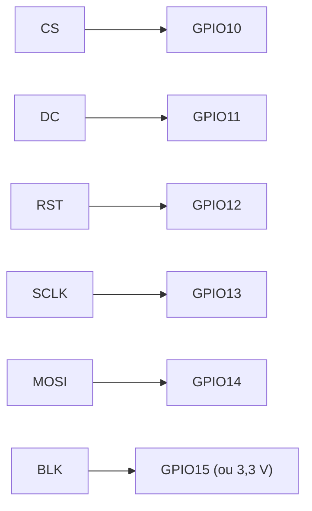

## Écran SPI et game loop

Ce tutoriel ajoute la dernière brique matérielle du montage : l'**écran**. Le câblage des boutons et du joystick posé au tutoriel [Boutons, joystick et moniteur série](/workshops/microcontroleur/tutorials/entrees-boutons-joystick/) ne bouge pas. À la fin, une balle rebondit sur l'écran — la première brique visuelle du Pong.

### Câblage additionnel de l'atelier

| Signal | Broche | Rôle |
|---|---|---|
| CS | GPIO10 | Sélection de l'écran sur le bus SPI |
| DC | GPIO11 | Bascule commande / donnée |
| RST | GPIO12 | Reset matériel de l'écran |
| SCLK | GPIO13 | Horloge SPI |
| MOSI | GPIO14 | Données CPU → écran |
| BLK (rétroéclairage) | GPIO15 ou 3,3 V direct | Allumage du rétroéclairage |







```ini
[env:esp32-s3-devkitc-1]
platform = espressif32
board = esp32-s3-devkitc-1
framework = arduino
monitor_speed = 115200
lib_deps =
    bodmer/TFT_eSPI@^2.5.0
build_flags =
    -DUSER_SETUP_LOADED=1
    -include User_Setup.h
```

```cpp
// User_Setup.h (extrait clé en main — pins figées de l'atelier)
#define ST7789_DRIVER      // adapter selon le contrôleur de ton écran

#define TFT_CS   10
#define TFT_DC   11
#define TFT_RST  12
#define TFT_SCLK 13
#define TFT_MOSI 14

#define SPI_FREQUENCY  40000000
```







```cpp
#include <TFT_eSPI.h>

TFT_eSPI tft = TFT_eSPI();

void setup() {
  tft.init();
  tft.setRotation(1);              // paysage
  tft.fillScreen(TFT_BLACK);

  tft.setTextColor(TFT_WHITE, TFT_BLACK);
  tft.setTextSize(2);
  tft.setCursor(10, 10);
  tft.print("PONG");

  tft.drawRect(20, 40, 60, 20, TFT_WHITE);   // rectangle contour
  tft.fillCircle(160, 60, 8, TFT_WHITE);     // cercle plein
}

void loop() {}
```





```cpp
#define JOY_Y 2

int raquetteY = 60;

void dessinerRaquette(int y, uint16_t couleur) {
  tft.fillRect(10, y, 6, 30, couleur);
}

void loop() {
  int y = map(analogRead(JOY_Y), 0, 4095, 0, tft.height() - 30);

  if (y != raquetteY) {
    dessinerRaquette(raquetteY, TFT_BLACK);  // efface l'ancienne position
    dessinerRaquette(y, TFT_WHITE);          // dessine la nouvelle
    raquetteY = y;
  }
}
```





```cpp
unsigned long dernierUpdate = 0;
const unsigned long INTERVALLE = 16;  // ~60 images/seconde

void loop() {
  unsigned long maintenant = millis();

  if (maintenant - dernierUpdate >= INTERVALLE) {
    dernierUpdate = maintenant;

    lireEntrees();
    mettreAJourJeu();
    redessiner();
  }
}
```

Cette structure **lire → mettre à jour → redessiner** est la charpente de toute la suite du projet : le tutoriel [Collisions, score et machine à états](/workshops/microcontroleur/tutorials/td4-collisions-fsm-pong/) et le projet Snake ne feront qu'enrichir `mettreAJourJeu()` et `redessiner()`.



```cpp
int balleX = 160, balleY = 60;
int balleVX = 3, balleVY = 2;

void mettreAJourJeu() {
  balleX += balleVX;
  balleY += balleVY;

  if (balleY <= 0 || balleY >= tft.height())  balleVY = -balleVY;
  if (balleX >= tft.width())                  balleVX = -balleVX;
}

void redessiner() {
  static int ancienX = balleX, ancienY = balleY;

  tft.fillCircle(ancienX, ancienY, 4, TFT_BLACK);  // efface l'ancienne position
  tft.fillCircle(balleX, balleY, 4, TFT_WHITE);    // dessine la nouvelle

  ancienX = balleX;
  ancienY = balleY;
}
```



## Résultat attendu

Une balle blanche se déplace en continu sur l'écran et rebondit sur les bords, sans clignotement ni traînée visible, pendant que la raquette du joueur 2 suit le joystick.


