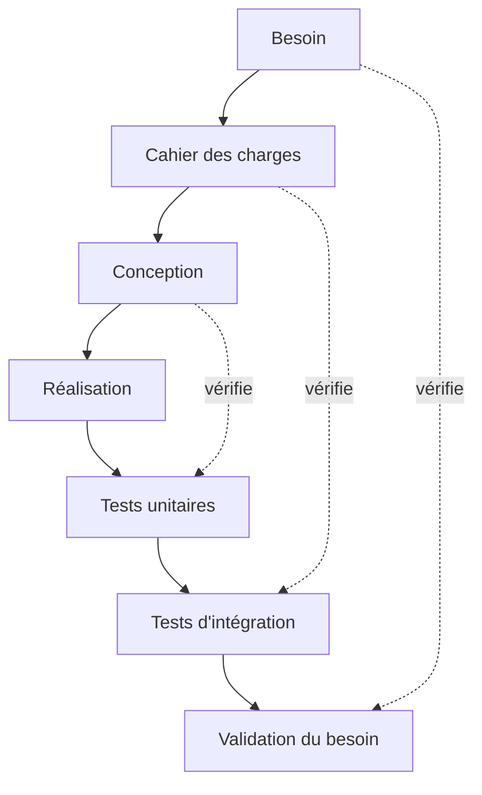
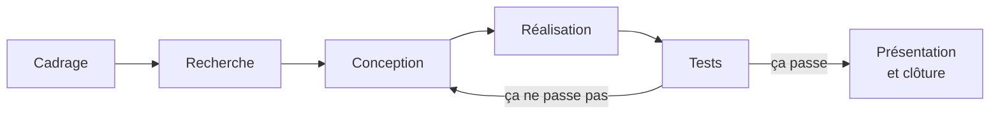

## Une vue d'ensemble avant de zoomer

Le reste de cet atelier détaille chaque étape d'un projet une par une —
cadrage, recherche, conception, réalisation, tests, présentation. Avant de
plonger dans le détail de la première, il est utile d'avoir la carte
complète du chemin : ça évite de perdre de vue où on va, et ça explique
pourquoi les pages suivantes de l'atelier sont dans cet ordre-là et pas un
autre.

## Le cycle en V : le modèle que vous connaissez déjà

Vous avez probablement déjà croisé le **cycle en V** dans vos autres cours
d'ingénierie. L'idée : chaque étape de conception (branche descendante) a
une étape de vérification miroir (branche ascendante) qui contrôle qu'on a
bien répondu à ce qui avait été décidé plus haut.



## Les étapes, dans cet atelier

Pour un projet MakerSpace, on simplifie le cycle en V en une version plus
directe, avec une boucle explicite : si les tests ne passent pas, on
retourne en conception, pas à la case départ.

- **Cadrage** : définir le besoin et écrire le cahier des charges — voir
  [Définir son besoin et son cahier des charges](/workshops/methodologie-de-projet/concepts/definir-son-besoin/).
- **Recherche** : regarder ce qui existe déjà, étudier la faisabilité
  technique avant de s'engager.
- **Conception** : choisir et comparer des solutions techniques, itérer sur
  des prototypes.
- **Réalisation** : fabriquer/assembler chaque brique du projet (carte
  électronique, pièces mécaniques, code).
- **Tests** : vérifier que chaque brique, puis l'ensemble, répond aux
  critères de réussite fixés au cadrage.
- **Présentation et clôture** : poster, vidéo, documentation finale, passer
  la main à la suite.



## Ce qui tourne en continu, pas par étapes

Trois choses ne sont **pas des étapes du schéma ci-dessus** : elles se
passent en parallèle, du premier jour au dernier.

- **Documenter** : au fil de l'eau, pas seulement à la présentation finale.
- **Gérer l'équipe et communiquer** : répartition des tâches, points de
  synchro réguliers.
- **Suivre le temps** : jalons, délais externes (commandes, impression 3D)
  qui ne dépendent pas de vous.

Chacun de ces trois points a sa propre page dans cet atelier — ce sont eux
qui font la différence entre une équipe qui livre un prototype qui fonctionne
et une équipe qui livre un prototype **documenté, compris et transmissible**.

## Exercice

En équipe, sur votre projet actuel :

1. Situez-vous sur le schéma "Les étapes, dans cet atelier" : à quelle
   étape êtes-vous précisément aujourd'hui ?
2. Identifiez, parmi les trois éléments "en continu", celui que votre
   équipe néglige le plus en ce moment. Décidez d'une action concrète pour
   cette semaine.
