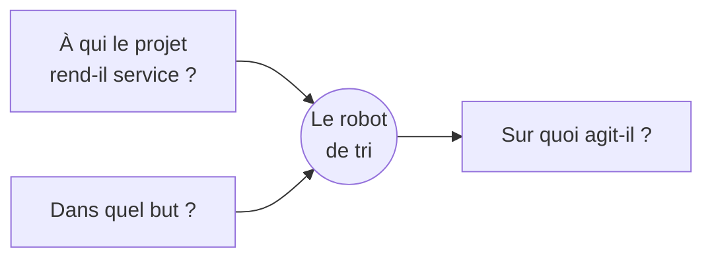
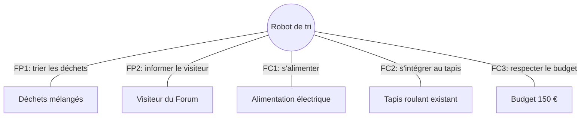

## Le piège du "on verra en avançant"

Sur un projet, l'envie de commencer à souder, imprimer ou coder est
forte — c'est souvent pour ça qu'on s'inscrit au MakerSpace. Mais démarrer
sans avoir posé le besoin, c'est le meilleur moyen de refaire les mêmes choix
trois fois, de découvrir une contrainte bloquante à la semaine 6, ou de
livrer un prototype qui ne répond plus du tout à la question de départ.



Un cahier des charges n'a pas besoin d'être long ni formel. Il doit juste
répondre clairement à cinq questions, **avant** la première ligne de code
ou la première pièce imprimée.

## Les cinq questions à se poser

Posez-vous ces questions dans cet ordre — c'est le raisonnement naturel :
pourquoi → quoi → pour qui → avec quelles limites → comment on vérifie.
Ce sont exactement les cinq sections du gabarit plus bas, dans le même
ordre : ce que vous répondez ici, vous le recopiez tel quel dedans.

- **Contexte** : pourquoi ce projet existe-t-il ? Quel problème observé,
  quelle opportunité ?
- **Objectifs** : qu'est-ce que le projet doit accomplir concrètement,
  formulé de façon vérifiable (pas un vœu pieux) ?
- **Public cible** : qui va utiliser ou voir ce projet ? Un jury, des
  visiteurs du Forum des Sciences, une prochaine promo qui reprendra le
  travail ?
- **Contraintes** : temps disponible, budget, matériel accessible au
  MakerSpace, compétences réelles de l'équipe (pas celles qu'on espère
  acquérir en cours de route).
- **Critères de réussite** : comment saurez-vous, à la fin, que le projet a
  atteint son objectif ? Si la réponse est floue, l'objectif l'est aussi.

## Objectif vague vs objectif précis : un exemple

C'est la section "Objectifs" qui fait le plus souvent défaut : la
différence entre un objectif mal cadré et un objectif bien cadré se voit
immédiatement à la lecture.



**Objectif** : "Faire un robot qui trie les déchets."

**Ce qui manque** : quel volume de déchets, quelles catégories, quel
budget, quelle échéance, quel niveau de fiabilité attendu. Avec cet énoncé,
l'équipe ne peut pas savoir si elle a fini, ni si elle est encore dans les
clous à mi-parcours.





**Objectif** : "Concevoir un robot capable de trier 3 catégories de déchets
(plastique, verre, métal) déposés sur un tapis roulant de 1 m, pour une
démonstration au Forum des Sciences du 15 mai. Budget maximum 150 €, délai
de 8 semaines, taux de tri correct visé : 80 % minimum sur 20 essais."

**Ce que ça permet** : l'équipe peut se répartir le travail, savoir si un
choix technique rentre dans le budget, et vérifier objectivement à la fin
si l'objectif est atteint.





## Un gabarit simple à réutiliser

Vous n'avez pas besoin d'inventer un format. Ce gabarit tient dans le fichier
`docs/objectifs.md` du repo template — copiez-le et remplissez-le en équipe
dès la première réunion de projet.

```markdown
## Contexte

<Pourquoi ce projet existe. Quel problème observé, quelle opportunité.>

## Objectifs

<Ce que le projet doit accomplir, formulé de façon vérifiable.>

## Public cible

<Qui utilise ou évalue le résultat.>

## Contraintes

- Délai :
- Budget :
- Matériel / machines disponibles :
- Compétences de l'équipe :

## Critères de réussite

<Comment on sait, objectivement, que c'est réussi.>
```



### Exemple rempli

Voici à quoi ressemble le gabarit une fois rempli, sur le projet du robot de
tri utilisé en exemple sur cette page :

```markdown
## Contexte

Le Forum des Sciences d'Amiens souhaite une animation pédagogique sur le
tri sélectif pour son édition de mai. Aucune démonstration mécanique de
tri n'existe actuellement dans le programme.

## Objectifs

Concevoir un robot capable de trier 3 catégories de déchets (plastique,
verre, métal) déposés sur un tapis roulant de 1 m, pour une démonstration
publique le 15 mai.

## Public cible

Les visiteurs (familles, scolaires) et l'équipe d'animation du Forum des
Sciences, qui doit pouvoir faire fonctionner le robot sans notre présence
le jour J.

## Contraintes

- Délai : 8 semaines
- Budget : 150 € maximum
- Matériel / machines disponibles : imprimante 3D, découpe laser, Arduino
- Compétences de l'équipe : électronique de base, aucune expérience en
  vision par caméra

## Critères de réussite

Taux de tri correct ≥ 80 % sur 20 essais, robot fonctionnant sans
supervision technique pendant la démonstration, coût total ≤ 150 €.
```

Remarquez que "Contexte" et "Objectifs" ne disent pas la même chose : le
premier explique *pourquoi* le projet existe, le second dit *ce qu'il faut
livrer*. Si vous ne savez pas quoi écrire dans "Objectifs", relisez votre
"Contexte" — l'objectif est souvent la réponse directe au problème posé.

Pour remplir les sections "Objectifs" et "Critères de réussite" sans rester
au niveau des intentions vagues, il existe quelques méthodes outillées —
elles sont détaillées juste en dessous. Elles ne servent pas qu'à remplir
un document : elles produisent un support concret que vous réutiliserez
plus tard dans le projet pour comparer et justifier de vrais choix
techniques.

## Pour aller plus loin : le cahier des charges fonctionnel

Le gabarit ci-dessus suffit pour la grande majorité des projets du
MakerSpace. Si votre projet est plus ambitieux, ou si votre référent
pédagogique attend une démarche d'ingénierie plus formalisée, l'**analyse
fonctionnelle** (norme NF EN 16271) donne trois outils simples pour muscler
le besoin avant de concevoir.



### La bête à cornes : formuler le besoin en une phrase

Elle force à répondre à trois questions autour du projet, pour arriver à un
énoncé de besoin en une phrase claire.



Pour l'exemple du robot de tri : *"Le robot de tri rend service aux
visiteurs du Forum des Sciences, en agissant sur des déchets mélangés, dans
le but de démontrer un tri automatique fiable."*

### Le diagramme pieuvre : lister les fonctions à assurer

Il place le produit au centre et fait apparaître les éléments de son
environnement (utilisateurs, autres objets, contraintes physiques). Chaque
lien devient une fonction à assurer :

- **FP** (fonction principale) : ce que le produit doit faire
- **FC** (fonction contrainte) : ce à quoi il doit s'adapter



Chaque fonction listée ici peut ensuite devenir un critère de réussite
concret dans votre gabarit.

### Le tableau des fonctions : rendre chaque fonction mesurable

Pour chaque fonction identifiée dans le diagramme pieuvre, on précise un
**critère d'appréciation** (comment on mesure), un **niveau** attendu
(la valeur visée), et une **flexibilité** (marge de négociation possible :
F0 = imposé, non négociable ; F1 = peu négociable ; F2 = négociable ;
F3 = souhait, pas indispensable).

| Fonction | Critère d'appréciation | Niveau attendu | Flexibilité |
|---|---|---|---|
| FP1 : trier les déchets | Taux de tri correct | ≥ 80 % sur 20 essais | F1 |
| FP2 : informer le visiteur | Lisibilité du panneau explicatif | Lisible à 2 m | F2 |
| FC1 : s'alimenter | Type d'alimentation | Secteur 220 V ou batterie ≥ 4 h | F0 |
| FC2 : s'intégrer au tapis | Largeur compatible avec le tapis | ≤ 1 m | F0 |
| FC3 : respecter le budget | Coût total du projet | ≤ 150 € | F0 |

| Fonction | Critère d'appréciation | Niveau attendu | Flexibilité |
|---|---|---|---|
| FP1 : ... | ... | ... | F0/F1/F2/F3 |
| FC1 : ... | ... | ... | F0/F1/F2/F3 |


C'est ce tableau, plus que les diagrammes eux-mêmes, qui devient directement
réutilisable : chaque ligne peut être copiée telle quelle dans les
"Critères de réussite" du gabarit vu plus haut.

### Le diagramme FAST : passer des fonctions aux solutions

Le FAST part d'une fonction (ex : "trier les déchets") et la décompose en
sous-fonctions techniques, jusqu'aux solutions concrètes envisagées. On ne
le détaille pas ici : il a surtout sa place plus tard dans le projet, au
moment de comparer et justifier des choix techniques — voir
[Tracer ses choix techniques](/workshops/methodologie-de-projet/concepts/tracer-choix-techniques/).

## Ce cahier des charges n'est pas figé

Un projet évolue : une contrainte matérielle imprévue, un composant en
rupture de stock, une idée qui s'avère meilleure en cours de route. Le
cahier des charges peut changer — mais il doit changer **consciemment et par
écrit**, pas silencieusement dans la tête d'une seule personne. Chaque
révision se documente au même endroit, avec la date et la raison du
changement.

C'est le lien direct avec la suite de l'atelier : ce document de cadrage est
la première pièce d'une documentation qui va vivre tout au long du projet,
pas seulement à la fin.

## Exercice

Sur votre propre projet, en équipe et à l'oral :

1. Remplissez les cinq sections du gabarit (Contexte, Objectifs, Public
   cible, Contraintes, Critères de réussite).
2. Relisez vos "Critères de réussite" : sont-ils vérifiables par quelqu'un
   d'extérieur à l'équipe, ou seulement compréhensibles par vous ?
3. Si votre projet est ambitieux ou que votre référent le demande, tracez
   rapidement une bête à cornes et un diagramme pieuvre en 15-20 minutes.
