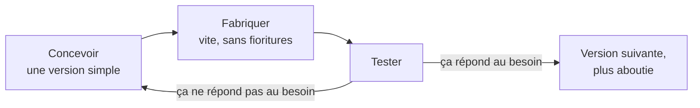

## Le piège de la version parfaite du premier coup

Face à un problème technique, le réflexe naturel est de vouloir concevoir
directement la solution finale, propre et aboutie. Le risque : passer trois
semaines sur une conception détaillée en CAO avant de découvrir, au premier
test, qu'une hypothèse de base était fausse — et devoir tout refaire.

Un prototype n'a qu'un seul travail : répondre à une question précise
("est-ce que ce mécanisme tient la charge ?", "est-ce que ce capteur est
assez précis ?"). Il n'a pas besoin d'être beau, robuste, ni définitif.

## V1 brute vs V1 parfaite



**Approche** : concevoir en CAO un mécanisme de tri complet, avec toutes
les tolérances, les fixations définitives et l'esthétique finale, avant de
rien imprimer.

**Résultat** : trois semaines passées, et au premier test, le capteur
choisi ne distingue pas bien le verre du plastique sous l'éclairage réel —
il faut revoir une bonne partie de la conception mécanique en plus du choix
du capteur.





**Approche** : imprimer en un après-midi un support minimal, juste de quoi
fixer le capteur et tester sous l'éclairage réel du Forum des Sciences.

**Résultat** : le problème de précision du capteur est découvert le jour
même, avant d'avoir investi du temps dans la conception mécanique complète.
Le mécanisme définitif peut être conçu en connaissant déjà le bon capteur.





## Un échec de test n'est pas un échec de projet



## Savoir quand s'arrêter d'itérer

Itérer sans fin n'est pas non plus la solution : à un moment, il faut
passer à la version suivante et avancer vers la présentation finale. Deux
repères pour trancher :

- Vos **critères de réussite** du cahier des charges sont-ils atteints ?
  Si oui, inutile de continuer à peaufiner.
- Votre **jalon planning** approche-t-il ? Un prototype qui répond à 90 %
  du besoin, livré à temps, vaut mieux qu'un prototype parfait livré en
  retard.

## Exercice

Sur votre projet, en équipe :

1. Identifiez la question technique qui vous inquiète le plus aujourd'hui.
2. Concevez le prototype le plus rapide possible (quelques heures, pas
   plusieurs jours) qui répond seulement à cette question — pas plus.
3. Testez-le et notez le résultat dans votre journal de bord, qu'il
   fonctionne ou non.
