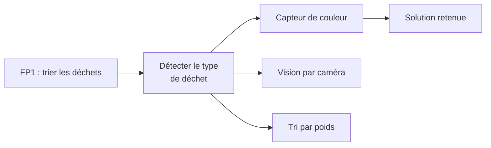

## Pourquoi tracer un choix, pas juste le faire

Une équipe qui choisit un composant, une architecture ou une méthode sans
noter pourquoi s'expose à deux problèmes : le même débat peut ressurgir
plus tard ("pourquoi on n'a pas pris l'autre capteur, déjà ?"), et personne
d'extérieur à la décision — un nouveau membre, un encadrant, une prochaine
promo — ne peut comprendre la logique du projet en le lisant.

## Des fonctions aux solutions : le diagramme FAST

C'est le moment annoncé dans
[Définir son besoin](/workshops/methodologie-de-projet/concepts/definir-son-besoin/) :
le diagramme FAST part d'une fonction du cahier des charges et explore les
solutions techniques possibles pour la remplir.



Ce n'est pas un exercice théorique : c'est directement la suite de la
pré-étude de faisabilité vue dans
[Rechercher l'existant](/workshops/methodologie-de-projet/concepts/rechercher-existant-faisabilite/) —
le test rapide du capteur de couleur, dans cet exemple, a nourri ce choix.

## Un format simple pour documenter un arbitrage

Pas besoin d'un document complexe. Pour chaque choix qui compte, quatre
questions suffisent :

```markdown
## Choix : capteur de couleur plutôt que vision par caméra

**Contexte** : le robot doit distinguer 3 catégories de déchets sous
l'éclairage réel du Forum des Sciences.

**Options envisagées** : capteur de couleur (TCS3200), vision par caméra
avec reconnaissance d'image, tri par poids.

**Choix retenu et pourquoi** : capteur de couleur — la pré-étude a montré
une précision suffisante sous l'éclairage réel, pour un coût et une
complexité bien inférieurs à la vision par caméra.

**Compromis acceptés** : moins précis qu'une caméra sur des déchets très
sales ou décolorés — acceptable pour une démonstration, à revoir si le
projet est repris pour un usage réel.
```



## Où ça vit

Ce fichier tient dans `docs/etudes.md` du repo template, à la suite du
tableau comparatif de la recherche de l'existant — les deux se complètent :
l'un compare des solutions externes, l'autre documente le choix final et
pourquoi.

## Exercice

Sur votre projet, en équipe :

1. Identifiez un choix technique déjà fait mais jamais écrit noir sur
   blanc (ça arrive presque toujours).
2. Rédigez-le avec le format ci-dessus, en équipe — c'est aussi l'occasion
   de vérifier que tout le monde est d'accord sur la raison du choix.
