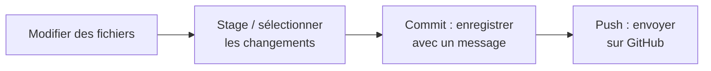

## Ce que fait Git, en une phrase

Git garde un historique complet de chaque modification de vos fichiers, et
GitHub héberge une copie de cet historique en ligne pour que toute
l'équipe travaille sur la même base. Le cycle de base, celui que vous
répéterez des dizaines de fois par semaine :

- **Modifier** : vous éditez des fichiers normalement, dans VSCode ou
  ailleurs — rien de spécial à Git à ce stade.
- **Stage** (mettre en attente) : vous choisissez quels fichiers modifiés
  vont dans le prochain commit. Utile si vous avez travaillé sur deux
  choses différentes en même temps : vous pouvez committer l'une sans
  l'autre.
- **Commit** : un instantané de ces modifications, avec un message qui
  explique quoi et pourquoi. Le commit reste **sur votre ordinateur**
  jusqu'au push suivant — personne d'autre ne le voit encore.
- **Push** : vos commits sont envoyés sur GitHub, où le reste de l'équipe
  peut les récupérer.
- **Fetch / Pull** : l'inverse du push — récupérer les commits que les
  autres ont envoyés sur GitHub, pour les avoir aussi sur votre machine.
  **Fetch** regarde ce qui a changé sans encore rien télécharger, **Pull**
  télécharge et applique les changements.



## Avec GitHub Desktop









## Directement depuis VSCode

VSCode intègre les mêmes fonctions sans changer d'application — pratique
si vous éditez déjà votre code ou votre documentation dedans. Le cycle
est le même que dans GitHub Desktop, juste réparti sur quatre petites
actions dans le même panneau.











## Résolution de problèmes

| Symptôme | Cause probable | Solution |
|---|---|---|
| "Push" échoue avec une erreur de rejet | Quelqu'un d'autre a push avant vous, votre historique local est en retard | Faites **Fetch origin** puis **Pull**, réglez les conflits éventuels ([voir le guide dédié](/docs/how-to-guides/pull-requests-et-conflits-git/)), puis repush |
| Un fichier que vous ne voulez pas suivre apparaît dans Changes | Fichier généré ou temporaire non exclu | Ajoutez-le à `.gitignore` |
| Le bouton Commit reste grisé | Aucun message de commit écrit, ou aucun fichier staged | Vérifiez les deux |

## Pour aller plus loin

Si vous voulez une explication plus posée, en vidéo, des concepts vus
ici (dépôt, branche, fork, pull request...) :
[Git and GitHub for Poets](https://thecodingtrain.com/tracks/git-and-github-for-poets),
une série de 11 courtes vidéos par The Coding Train, en anglais mais très
accessible même sans vocabulaire technique de départ.

## Exercice

Modifiez n'importe quel fichier de votre repo (par exemple, ajoutez une
ligne dans `docs/objectifs.md`), puis faites le cycle complet : stage,
commit avec un message précis, push. Vérifiez sur GitHub.com que votre
commit apparaît bien dans l'historique du repo.
