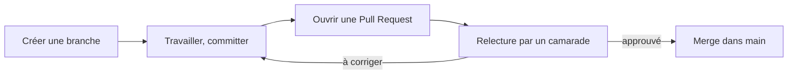



## Pourquoi ne pas pousser directement sur `main`

Travailler directement sur la branche principale (`main`) fonctionne tant
qu'on est seul. À plusieurs, ça mène vite à des conflits et à du code non
relu qui casse ce qui marchait. Une **Pull Request** (PR) propose vos
modifications, les rend visibles avant qu'elles n'atteignent `main`, et
donne à quelqu'un d'autre l'occasion de les relire.

## Créer une branche



## Ouvrir la Pull Request



## Relire le travail d'un camarade





## Fusionner (merge)



## Résolution de problèmes

| Symptôme | Cause probable | Solution |
|---|---|---|
| Bouton "Merge" grisé | Un reviewer a demandé des changements, pas encore résolus | Corrigez, repushez sur la même branche, la PR se met à jour automatiquement |
| "This branch has conflicts" | La branche principale a évolué depuis la création de votre branche | Voir [Résoudre un conflit Git](/workshops/methodologie-de-projet/tutorials/resoudre-conflit-git/) |
| Personne ne relit jamais les PR | Pas de reviewer assigné, ou pas d'habitude d'équipe prise | Assignez systématiquement un reviewer, décidé au point de synchro |

## Exercice

Sur votre projet, faites une PR pour votre prochaine petite modification :
créez une branche, committez, ouvrez la PR, demandez à un camarade de la
relire avant de merger — même pour un changement mineur, histoire de
prendre l'habitude.
