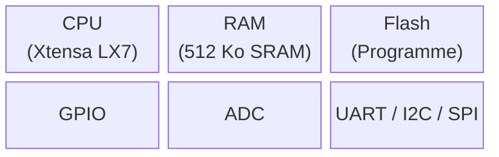

## Qu'est-ce qu'un microcontrôleur ?

Un **microcontrôleur** (µC) est un circuit intégré qui regroupe sur une seule puce :

- un **processeur** (CPU) pour exécuter les instructions,
- de la **mémoire** (Flash + RAM) pour stocker le programme et les données,
- des **périphériques** (GPIO, ADC, UART, SPI…) pour interagir avec le monde physique.

À la différence d'un microprocesseur seul (qui a besoin de mémoire et de périphériques externes pour fonctionner), le µC est un **système sur puce** (*System on Chip*) : tout est intégré au même silicium. Il suffit d'une alimentation et d'une horloge pour qu'il fonctionne — c'est ce qui le rend si présent autour de nous : télécommandes, jouets, écouteurs, tableaux de bord, drones… la plupart contiennent un ou plusieurs microcontrôleurs sans qu'on y pense.



## Le schéma-bloc fil rouge

{% include step-tuto.html
greyBackground = true
content="
Ce schéma sera ré-affiché à chaque nouveau concept en surlignant la brique concernée. Garde-le en tête — il sert de carte mentale pour tout l'atelier.


| Bloc | Rôle | Accès logiciel |
|---|---|---|
| **CPU** | Exécute les instructions une par une | — |
| **Flash** | Stocke le programme (persistant) | Lecture seule à l'exécution |
| **RAM** | Variables, pile d'appels (volatile) | Lecture/écriture rapide |
| **Périphériques** | GPIO, ADC, UART, SPI, I2C, PWM… | Via **registres** |
| **Bus** | Relie CPU ↔ mémoires ↔ périphériques | Transparent pour le code Arduino |
"
image="functional-block-diagram.png" %}

## CPU — le chef d'orchestre

Le CPU exécute un **cycle fetch–decode–execute** en continu :

1. **Fetch** — lire l'instruction suivante en Flash
2. **Decode** — la décoder
3. **Execute** — l'exécuter (calcul, accès mémoire, écriture registre)

Ce cycle est cadencé par l'**horloge** : l'ESP32-S3 tourne à **240 MHz**, soit 240 millions de cycles par seconde. Un `digitalWrite()` prend quelques cycles ; une multiplication quelques dizaines.

L'ESP32-S3 possède **deux cœurs** Xtensa LX7. Dans le cadre Arduino-ESP32, le code `setup()`/`loop()` tourne sur le cœur 1 ; le cœur 0 gère le Wi-Fi en arrière-plan.

## L'horloge — cadencer et économiser l'énergie

Rien ne bouge dans un microcontrôleur sans horloge : c'est elle qui impose le rythme auquel le CPU et les périphériques avancent d'une étape à la suivante, comme une chaîne de fabrication robotisée où chaque poste doit être synchronisé avec le suivant. Sa source est généralement un **cristal de quartz** externe : soumis à une tension, il oscille à une fréquence extrêmement stable — le même principe que dans une montre à quartz.

Plus la fréquence est élevée, plus le CPU exécute d'instructions par seconde — mais plus il consomme d'énergie et chauffe. C'est pour ça que les microcontrôleurs plafonnent en général à quelques centaines de MHz, loin des ~5 GHz d'un processeur de PC : ils visent l'autonomie sur batterie, pas la performance brute.



## Mémoires — Flash vs RAM

| | Flash | RAM (SRAM) |
|---|---|---|
| **Contenu** | Programme compilé, constantes | Variables, pile, heap |
| **Persistance** | Oui (survit à un reset) | Non (perdu à l'extinction) |
| **Vitesse** | Plus lente | Très rapide |
| **Taille ESP32-S3** | 8 Mo (externe) | 512 Ko interne |

```cpp
// En Flash (programme + constantes)
const char msg[] PROGMEM = "Hello";

// En RAM (variable)
int compteur = 0;
```

## Les registres — interface logiciel/matériel

Chaque périphérique est contrôlé via des **registres** : des cases mémoire à des adresses fixes. Écrire dans un registre allume une LED ; lire un registre retourne l'état d'un bouton.

Arduino abstrait tout ça : `digitalWrite(LED, HIGH)` écrit dans le bon registre sans que tu aies à connaître son adresse. Mais derrière, c'est toujours un accès registre.

## Périphériques — le glossaire

Un microcontrôleur embarque une collection de circuits spécialisés, chacun désigné par un acronyme. En voici les plus courants :

| Acronyme | Nom complet | Rôle |
|---|---|---|
| **GPIO** | General Purpose Input/Output | Broches numériques configurables en entrée ou sortie — voir [GPIO & monde numérique](/workshops/microcontroleur/concepts/gpio-monde-numerique/) |
| **ADC** | Analog to Digital Converter | Convertit une tension analogique en valeur numérique — voir [ADC & PWM](/workshops/microcontroleur/concepts/adc-pwm/) |
| **UART / I2C / SPI** | — | Bus de communication série — voir [Les bus de communication](/workshops/microcontroleur/concepts/bus-communication/) |
| **Timer** | Compteur matériel | Cadence des événements périodiques ou génère du PWM, indépendamment du CPU |
| **DMA** | Direct Memory Access | Transfère des données entre mémoire et périphérique sans mobiliser le CPU |
| **RTC** | Real-Time Clock | Horloge qui continue de tourner en veille profonde, pour réveiller la puce à une heure précise |
| **Watchdog** | *Chien de garde* | Compteur qui redémarre le microcontrôleur si le programme se bloque et oublie de le réinitialiser à temps |



## Interruptions — réagir sans attendre

Le CPU exécute `loop()` en continu, mais certains événements ne peuvent pas attendre le prochain passage dans la boucle — un bouton pressé pendant une longue routine, par exemple. Une **interruption** suspend momentanément l'exécution normale pour exécuter une petite fonction dédiée, puis reprend exactement où elle s'était arrêtée.

```cpp
void IRAM_ATTR surAppui() {
  compteurAppuis++;  // aussi court et rapide que possible
}

void setup() {
  attachInterrupt(digitalPinToInterrupt(BTN_PIN), surAppui, FALLING);
}
```



## L'ESP32-S3 en bref

| Caractéristique | Valeur |
|---|---|
| CPU | Xtensa LX7 dual-core 240 MHz |
| RAM | 512 Ko SRAM + 8 Mo PSRAM optionnel |
| Flash | 8 Mo (externe via SPI) |
| GPIO | 45 broches (dont 20 ADC-capable) |
| Tension logique | **3,3 V** (≠ 5 V des Arduino classiques) |
| Connectivité | Wi-Fi 802.11 b/g/n + Bluetooth 5 |



## Résumé

- Un µC = CPU + Flash + RAM + périphériques sur une seule puce — un **système sur puce** autonome.
- Le CPU exécute des instructions cadencées par l'**horloge** (240 MHz pour l'ESP32-S3) ; couper l'horloge d'un périphérique inutilisé économise de l'énergie.
- Flash = programme (persistant) ; RAM = données en cours d'exécution (volatile).
- Les périphériques (GPIO, ADC, Timer, DMA, RTC, Watchdog…) sont contrôlés via des **registres** — Arduino s'en charge pour toi.
- Une **interruption** permet de réagir immédiatement à un événement sans attendre le prochain passage dans `loop()`.
- Tension logique ESP32-S3 : **3,3 V** (pas 5 V).
