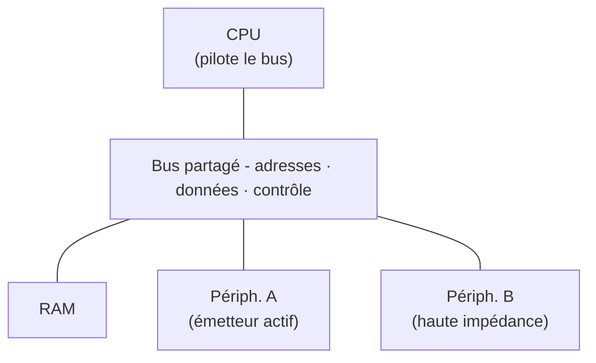

## Ouvrons le capot

Si tu as parcouru [Qu'est-ce qu'un microcontrôleur ?](/workshops/microcontroleur/concepts/qu-est-ce-qu-un-microcontroleur/), tu sais déjà qu'un µC est un ordinateur miniature qui perçoit, décide et agit. Voyons maintenant **comment il est fait à l'intérieur**.

Techniquement, un **microcontrôleur** (µC) est un circuit intégré qui regroupe sur une seule puce :

- un **processeur** (CPU) pour exécuter les instructions,
- de la **mémoire** (Flash + RAM) pour stocker le programme et les données,
- des **périphériques** (GPIO, ADC, UART, SPI…) pour interagir avec le monde physique.

À la différence d'un microprocesseur seul (qui a besoin de mémoire et de périphériques externes pour fonctionner), le µC est un **système sur puce** (*System on Chip*) : tout est intégré au même **silicium** (le matériau semi-conducteur dont est faite la puce). Il suffit d'une alimentation et d'une horloge pour qu'il fonctionne.

**À la fin de ce concept, tu sauras :**

- nommer les grands blocs d'un µC (CPU, mémoires, périphériques, bus) ;
- expliquer le rôle du CPU, de l'ALU et de l'horloge ;
- comprendre les registres, les interruptions et le partage du bus.

## Le schéma-bloc fil rouge

{% include step-tuto.html
greyBackground = true
content="
Garde ce schéma en tête : il sert de carte mentale pour tout l'atelier. Chaque concept qui suit - [GPIO](/workshops/microcontroleur/concepts/gpio-monde-numerique/), [ADC & PWM](/workshops/microcontroleur/concepts/adc-pwm/), [les bus](/workshops/microcontroleur/concepts/bus-communication/)… - vient détailler l'une de ces briques.

| Bloc | Rôle | Accès logiciel |
|---|---|---|
| **CPU** | Exécute les instructions une par une | - |
| **Flash** | Stocke le programme (persistant) | Lecture seule à l'exécution |
| **RAM** | Variables, pile d'appels (volatile) | Lecture/écriture rapide |
| **Périphériques** | GPIO, ADC, UART, SPI, I2C, PWM… | Via **registres** |
| **Bus** | Relie CPU ↔ mémoires ↔ périphériques | Transparent pour le code Arduino |
"
image="functional-block-diagram.png" %}

## CPU - le chef d'orchestre

Le CPU exécute un **cycle fetch–decode–execute** en continu :

1. **Fetch** lire l'instruction suivante en Flash
2. **Decode** la décoder
3. **Execute** l'exécuter (calcul, accès mémoire, écriture registre)

Ce cycle est cadencé par l'**horloge** : l'ESP32-S3 tourne à **240 MHz**, soit 240 millions de cycles par seconde. Un `digitalWrite()` prend quelques cycles ; une multiplication quelques dizaines.

L'ESP32-S3 possède **deux cœurs** (deux unités de calcul quasi indépendantes, capables de travailler en parallèle) Xtensa LX7. Dans le cadre Arduino-ESP32, le code `setup()`/`loop()` tourne sur le cœur 1 ; le cœur 0 gère le Wi-Fi en arrière-plan.

### Ce que fait vraiment le CPU : calculer ou transférer

Au fond, un CPU ne sait faire que deux choses : **des calculs** et **des transferts de données**. Tout programme, aussi complexe soit-il, se ramène à cette combinaison combiner deux nombres, ou déplacer un octet d'une case vers une autre.

Les calculs sont réalisés par l'**ALU** (*Arithmetic Logic Unit*, unité arithmétique et logique), le cœur mathématique du CPU. Elle prend deux nombres en entrée et produit :

- des **opérations arithmétiques** : addition, soustraction, multiplication…
- des **opérations logiques** : ET, OU, OU-exclusif (XOR), décalages de bits…

À chaque opération, l'ALU met aussi à jour quelques **drapeaux d'état** (*flags*) qui résument le résultat sans qu'on ait à le relire : est-il **nul** (*zero*) ? **négatif** ? y a-t-il eu une **retenue** (*carry*) ou un **dépassement** de capacité (*overflow*) ? Ce sont ces drapeaux que le CPU consulte pour décider quoi faire ensuite - c'est exactement ce qui se cache derrière un `if (a > b)` en C : une soustraction, puis la lecture d'un drapeau.

Pour travailler vite, l'ALU ne pioche pas directement dans la RAM : elle passe par une poignée de **registres internes** au CPU - à ne pas confondre avec les registres de périphériques vus plus bas des cases ultra-rapides où sont posés les opérandes le temps du calcul.

## L'horloge - cadencer et économiser l'énergie

Rien ne bouge dans un microcontrôleur sans horloge : c'est elle qui impose le rythme auquel le CPU et les périphériques avancent d'une étape à la suivante, comme une chaîne de fabrication robotisée où chaque poste doit être synchronisé avec le suivant. Sa source est généralement un **cristal de quartz** externe : soumis à une tension, il oscille à une fréquence extrêmement stable - le même principe que dans une montre à quartz.

Plus la fréquence est élevée, plus le CPU exécute d'instructions par seconde - mais plus il consomme d'énergie et chauffe. C'est pour ça que les microcontrôleurs plafonnent en général à quelques centaines de MHz, loin des ~5 GHz d'un processeur de PC : ils visent l'autonomie sur batterie, pas la performance brute.



### Dormir pour durer - les modes veille

Pour un projet sur batterie, le microcontrôleur passe le plus clair de son temps à ne rien faire d'utile. Plutôt que de tourner à vide, il peut **dormir** :

- **Light sleep** : le CPU est suspendu mais la RAM et l'état sont conservés ; réveil quasi instantané.
- **Deep sleep** : presque tout est éteint sauf un petit domaine (RTC) ; la consommation tombe à quelques microampères, mais le programme **redémarre** au réveil (déclenché par un timer, une broche…).

C'est ce qui permet à un capteur sans fil de tenir des mois, voire des années, sur une simple pile.

## Mémoires - Flash vs RAM

| | Flash | RAM (SRAM) |
|---|---|---|
| **Contenu** | Programme compilé, constantes | Variables, pile (mémoire des appels de fonctions) et heap (allocation dynamique) |
| **Persistance** | Oui (survit à un reset) | Non (perdu à l'extinction) |
| **Vitesse** | Plus lente | Très rapide |
| **Taille ESP32-S3** | 8 Mo (externe) | 512 Ko interne |

```cpp
// En Flash (programme + constantes)
const char msg[] PROGMEM = "Hello";

// En RAM (variable)
int compteur = 0;
```

### Harvard ou Von Neumann ?

Deux grandes familles d'architectures décrivent *comment* le CPU accède au programme et aux données :

- **Von Neumann** : instructions et données partagent la **même** mémoire et le même bus. Simple, mais le CPU ne peut pas lire une instruction et une donnée au même instant.
- **Harvard** : instructions et données empruntent des **chemins séparés**, donc lisibles en parallèle - plus rapide.

Le cœur Xtensa LX7 de l'ESP32-S3 suit une architecture **Harvard modifiée** : les bus d'instructions et de données sont distincts, mais la Flash est « mappée » en mémoire via un cache, ce qui donne au programmeur l'illusion d'un espace unifié. Retiens surtout l'idée : le **programme** (Flash) et les **données** (RAM) vivent dans des espaces séparés.

## Le bus - l'autoroute de données partagée

Le CPU, les mémoires et les périphériques ne sont pas reliés deux à deux par des fils dédiés : ils partagent un **bus**, un faisceau de pistes communes sur lequel tout le monde est branché. On y distingue en général trois faisceaux :

- un **bus d'adresses** : le CPU y place l'adresse de la case qu'il veut lire ou écrire ;
- un **bus de données** : la valeur y transite dans un sens ou dans l'autre ;
- un **bus de contrôle** : quelques signaux qui précisent « je lis » ou « j'écris ».

Comme la ligne est partagée, une règle absolue s'impose : **un seul composant a le droit de "parler" (imposer une tension) à la fois**. Si deux périphériques poussaient une valeur en même temps sur le bus de données - l'un forçant un 0, l'autre un 1 - on obtiendrait un court-circuit.

Pour l'éviter, chaque composant se branche au bus via des **sorties trois états** : en plus de 0 et 1, elles disposent d'un état de **haute impédance** (*high-Z*) qui les déconnecte électriquement de la ligne. À tout instant, un seul émetteur est actif ; tous les autres sont en haute impédance, à l'écoute. C'est le bus d'adresses qui orchestre ce ballet : l'adresse émise par le CPU **sélectionne** le seul composant autorisé à répondre.



## Les registres - interface logiciel/matériel

Chaque périphérique est contrôlé via des **registres** : des cases mémoire à des adresses fixes. Écrire dans un registre allume une LED ; lire un registre retourne l'état d'un bouton.

Comment une adresse retrouve-t-elle la bonne case ? Un circuit appelé **décodeur d'adresse** compare l'adresse présente sur le bus et n'active que la cellule correspondante ; toutes les autres restent en haute impédance. Le mécanisme est identique pour une case de RAM et pour un registre de périphérique : dans l'espace d'adressage du CPU, écrire une variable en mémoire et allumer une LED se ressemblent beaucoup - c'est la même opération « poser une valeur à telle adresse ».

Arduino abstrait tout ça : `digitalWrite(LED, HIGH)` écrit dans le bon registre sans que tu aies à connaître son adresse. Mais derrière, c'est toujours un accès registre.

## Périphériques - le glossaire

Un microcontrôleur embarque une collection de circuits spécialisés, chacun désigné par un acronyme. En voici les plus courants :

| Acronyme | Nom complet | Rôle |
|---|---|---|
| **GPIO** | General Purpose Input/Output | Broches numériques configurables en entrée ou sortie - voir [GPIO & monde numérique](/workshops/microcontroleur/concepts/gpio-monde-numerique/) |
| **ADC** | Analog to Digital Converter | Convertit une tension analogique en valeur numérique - voir [ADC & PWM](/workshops/microcontroleur/concepts/adc-pwm/) |
| **UART / I2C / SPI** | - | Bus de communication série - voir [Les bus de communication](/workshops/microcontroleur/concepts/bus-communication/) |
| **Timer** | Compteur matériel | Cadence des événements périodiques ou génère du PWM, indépendamment du CPU |
| **DMA** | Direct Memory Access | Transfère des données entre mémoire et périphérique sans mobiliser le CPU |
| **RTC** | Real-Time Clock | Horloge qui continue de tourner en veille profonde, pour réveiller la puce à une heure précise |
| **Watchdog** | *Chien de garde* | Compteur qui redémarre le microcontrôleur si le programme se bloque et oublie de le réinitialiser à temps |



## Le déroulement d'un programme

Avant de voir comment un événement peut « interrompre » le CPU, comprenons comment un programme se déroule **normalement**.

Un programme Arduino tient dans deux fonctions :

- `setup()` : exécutée **une seule fois** au démarrage, pour préparer le matériel (broches, périphériques…) ;
- `loop()` : exécutée **en boucle infinie**, tant que la carte est alimentée.

```cpp
void setup() {
  // une seule fois : initialisation
}

void loop() {
  // répété sans fin : le cœur du programme
}
```

Le CPU exécute ces instructions **les unes après les autres**, dans l'ordre, au rythme de l'horloge (le cycle *fetch–decode–execute* vu plus haut). Ce déroulement séquentiel est simple mais rigide : le programme ne fait qu'une chose à la fois et ne « regarde » un bouton qu'au moment où il atteint la ligne qui le lit.

C'est précisément cette limite que lèvent les interruptions. (Le trajet complet du code jusqu'à la puce est détaillé dans [Du matériel au logiciel](/workshops/microcontroleur/concepts/du-materiel-au-logiciel/).)

## Interruptions - réagir sans attendre

Le CPU exécute `loop()` en continu, mais certains événements ne peuvent pas attendre le prochain passage dans la boucle - un bouton pressé pendant une longue routine, par exemple. Une **interruption** suspend momentanément l'exécution normale pour exécuter une petite fonction dédiée, puis reprend exactement où elle s'était arrêtée.

```cpp
void IRAM_ATTR surAppui() {
  compteurAppuis++;  // aussi court et rapide que possible
}

void setup() {
  attachInterrupt(digitalPinToInterrupt(BTN_PIN), surAppui, FALLING);
}
```



## L'ESP32-S3 en bref

| Caractéristique | Valeur |
|---|---|
| CPU | Xtensa LX7 dual-core **32 bits**, 240 MHz |
| RAM | 512 Ko SRAM + 8 Mo PSRAM (RAM externe supplémentaire) en option |
| Flash | 8 Mo (externe via SPI) |
| GPIO | 45 broches (dont 20 ADC-capable) |
| Tension logique | **3,3 V** (≠ 5 V des Arduino classiques) |
| Connectivité | Wi-Fi 802.11 b/g/n + Bluetooth 5 |



## Quiz express

**1. Quelle mémoire conserve le programme quand la carte est éteinte ?**

<details><summary>Voir la réponse</summary>La Flash (persistante). La RAM, elle, est volatile : son contenu disparaît à l'extinction.</details>

**2. À quoi sert un registre de périphérique ?**

<details><summary>Voir la réponse</summary>À commander le périphérique : lire ou écrire à une adresse fixe (ex : allumer une LED, lire un bouton).</details>

**3. Pourquoi un seul composant peut-il « parler » sur le bus à la fois ?**

<details><summary>Voir la réponse</summary>Le bus est partagé : deux émetteurs simultanés (0 vs 1) créeraient un court-circuit. Les autres restent en haute impédance.</details>

## Pour aller plus loin

- [Chaîne d'outils & premier Blink](/workshops/microcontroleur/tutorials/toolchain-blink/) - voir cette architecture à l'œuvre sur un premier programme

## Résumé

- Un µC = CPU + Flash + RAM + périphériques sur une seule puce - un **système sur puce** autonome.
- Le CPU ne fait au fond que **calculer** (via l'**ALU**, qui lève des drapeaux nul/négatif/retenue/dépassement) et **transférer** des données ; le tout cadencé par l'**horloge** (240 MHz pour l'ESP32-S3), dont couper la source sur un périphérique inutilisé économise de l'énergie.
- Flash = programme (persistant) ; RAM = données en cours d'exécution (volatile) - deux espaces séparés (architecture **Harvard modifiée**).
- Tout le monde partage un **bus** : un seul composant parle à la fois, les autres passent en **haute impédance**, et l'**adresse** sélectionne le destinataire.
- Les périphériques (GPIO, ADC, Timer, DMA, RTC, Watchdog…) sont contrôlés via des **registres** - de simples cases à une adresse fixe, qu'Arduino manipule pour toi.
- Une **interruption** permet de réagir immédiatement à un événement sans attendre le prochain passage dans `loop()`.
- Les **modes veille** (light/deep sleep) coupent tout ou partie de la puce pour tenir longtemps sur batterie.
- Tension logique ESP32-S3 : **3,3 V** (pas 5 V).
