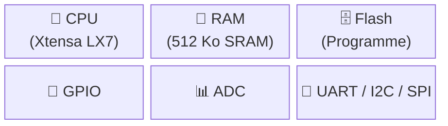

## Qu'est-ce qu'un microcontrôleur ?

Un **microcontrôleur** (µC) est un circuit intégré qui regroupe sur une seule puce :

- un **processeur** (CPU) pour exécuter les instructions,
- de la **mémoire** (Flash + RAM) pour stocker le programme et les données,
- des **périphériques** (GPIO, ADC, UART, SPI…) pour interagir avec le monde physique.

À la différence d'un microprocesseur (qui a besoin de composants externes), le µC est **autonome** : il suffit d'une alimentation et d'une horloge pour qu'il fonctionne.



## Le schéma-bloc fil rouge

Ce schéma sera ré-affiché à chaque nouveau concept en surlignant la brique concernée. Garde-le en tête — il sert de carte mentale pour tout l'atelier.

| Bloc | Rôle | Accès logiciel |
|---|---|---|
| **CPU** | Exécute les instructions une par une | — |
| **Flash** | Stocke le programme (persistant) | Lecture seule à l'exécution |
| **RAM** | Variables, pile d'appels (volatile) | Lecture/écriture rapide |
| **Périphériques** | GPIO, ADC, UART, SPI, I2C, PWM… | Via **registres** |
| **Bus** | Relie CPU ↔ mémoires ↔ périphériques | Transparent pour le code Arduino |

## CPU — le chef d'orchestre

Le CPU exécute un **cycle fetch–decode–execute** en continu :

1. **Fetch** — lire l'instruction suivante en Flash
2. **Decode** — la décoder
3. **Execute** — l'exécuter (calcul, accès mémoire, écriture registre)

L'**horloge** cadence ce cycle. L'ESP32-S3 tourne à **240 MHz** — soit 240 millions de cycles par seconde. Un `digitalWrite()` prend quelques cycles ; une multiplication quelques dizaines.

L'ESP32-S3 possède **deux cœurs** Xtensa LX7. Dans le cadre Arduino-ESP32, le code `setup()`/`loop()` tourne sur le cœur 1 ; le cœur 0 gère le Wi-Fi en arrière-plan.

## Mémoires — Flash vs RAM

| | Flash | RAM (SRAM) |
|---|---|---|
| **Contenu** | Programme compilé, constantes | Variables, pile, heap |
| **Persistance** | Oui (survit à un reset) | Non (perdu à l'extinction) |
| **Vitesse** | Plus lente | Très rapide |
| **Taille ESP32-S3** | 8 Mo (externe) | 512 Ko interne |

```cpp
// En Flash (programme + constantes)
const char msg[] PROGMEM = "Hello";

// En RAM (variable)
int compteur = 0;
```

## Les registres — interface logiciel/matériel

Chaque périphérique est contrôlé via des **registres** : des cases mémoire à des adresses fixes. Écrire dans un registre allume une LED ; lire un registre retourne l'état d'un bouton.

Arduino abstrait tout ça : `digitalWrite(LED, HIGH)` écrit dans le bon registre sans que tu aies à connaître son adresse. Mais derrière, c'est toujours un accès registre.

## L'ESP32-S3 en bref

| Caractéristique | Valeur |
|---|---|
| CPU | Xtensa LX7 dual-core 240 MHz |
| RAM | 512 Ko SRAM + 8 Mo PSRAM optionnel |
| Flash | 8 Mo (externe via SPI) |
| GPIO | 45 broches (dont 20 ADC-capable) |
| Tension logique | **3,3 V** (≠ 5 V des Arduino classiques) |
| Connectivité | Wi-Fi 802.11 b/g/n + Bluetooth 5 |



## Résumé

- Un µC = CPU + Flash + RAM + périphériques sur une seule puce.
- Le CPU exécute des instructions cadencées par l'horloge (240 MHz pour l'ESP32-S3).
- Flash = programme (persistant) ; RAM = données en cours d'exécution (volatile).
- Les périphériques sont contrôlés via des **registres** — Arduino s'en charge pour toi.
- Tension logique ESP32-S3 : **3,3 V** (pas 5 V).
