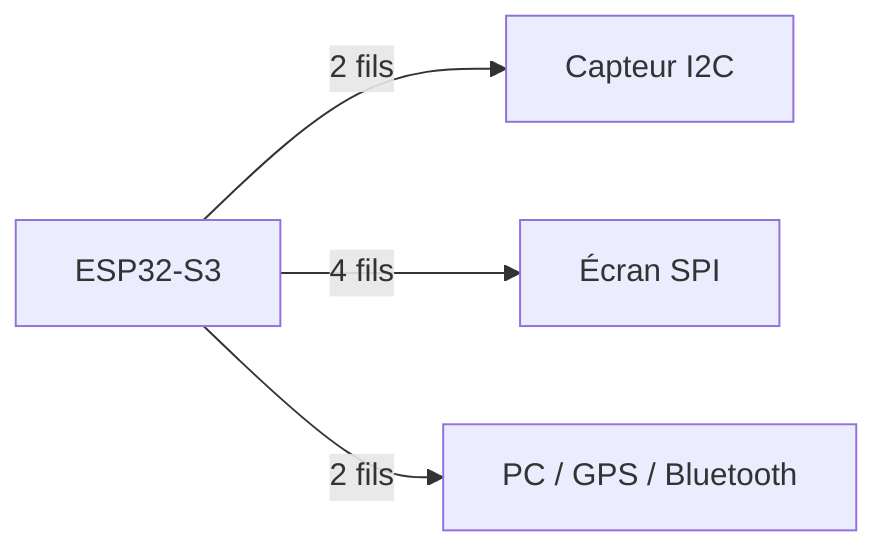
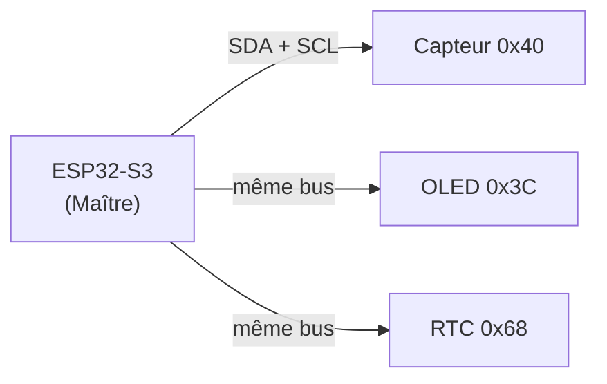
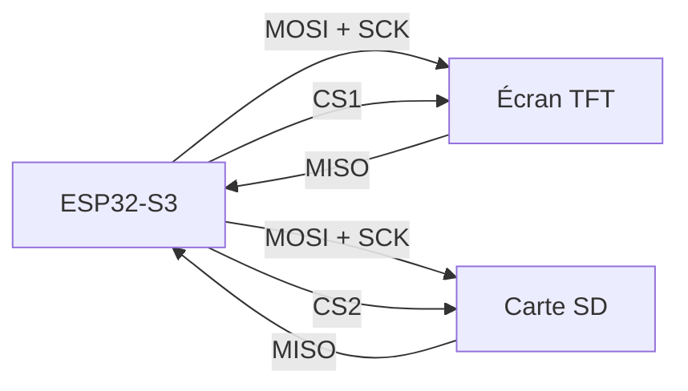
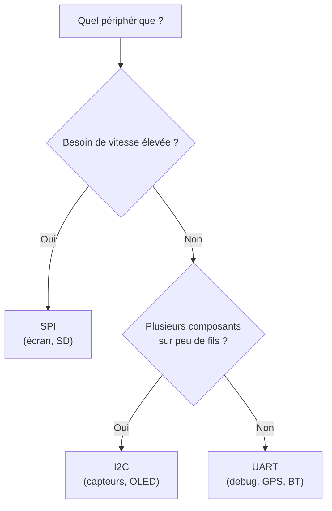

## Pourquoi des bus ?

Relier chaque périphérique au CPU par une broche dédiée serait impraticable : un écran 240×240 nécessiterait des milliers de fils. Les **bus de communication** permettent de transmettre des données sur un petit nombre de fils en les envoyant bit par bit ou octet par octet.



## UART — Universal Asynchronous Receiver-Transmitter

### Principe

UART est le bus le plus simple : **deux fils**, point à point (une liaison directe entre deux appareils seulement), sans horloge partagée.

| Fil | Rôle |
|---|---|
| **TX** | Transmission (sortie du µC) |
| **RX** | Réception (entrée du µC) |

La vitesse est fixée à l'avance des deux côtés (**baud rate**, en bits/s). Valeur standard : **115 200 baud**.

```text
ESP32-S3 TX ──→ RX périphérique
ESP32-S3 RX ←── TX périphérique
```



### Usage principal

- **Moniteur série** (debug via USB)
- Modules GPS, Bluetooth, GSM
- Communication entre deux µC

```cpp
Serial.begin(115200);        // initialise UART0 (USB)
Serial.println("Hello !");   // envoie une ligne
int v = analogRead(A0);
Serial.println(v);           // affiche la valeur dans le moniteur série
```

## I2C — Inter-Integrated Circuit

### Principe

I2C relie **plusieurs périphériques** sur seulement **2 fils** grâce à un système d'adressage.

| Fil | Rôle |
|---|---|
| **SDA** | Données (bidirectionnel) |
| **SCL** | Horloge (générée par le maître) |

Chaque composant I2C possède une **adresse 7 bits** unique (ex : `0x3C` pour un écran OLED SSD1306). Le **maître** (l'appareil qui dirige les échanges — ici l'ESP32-S3) initie toujours la communication ; les autres, les **esclaves**, ne répondent que lorsqu'il les sollicite.



### Vitesses standard

| Mode | Vitesse |
|---|---|
| Standard | 100 kHz |
| Fast | 400 kHz |
| Fast+ | 1 MHz |

### Usage principal

- Capteurs (température, accéléromètre, IMU)
- Petits écrans OLED
- Mémoires EEPROM (petite mémoire non volatile réinscriptible)
- Cas où on chaîne plusieurs périphériques sur peu de broches

```cpp
#include <Wire.h>
Wire.begin(SDA_PIN, SCL_PIN);  // démarre I2C
// Les bibliothèques de capteurs utilisent Wire en arrière-plan
```

## SPI — Serial Peripheral Interface

### Principe

SPI est le bus **le plus rapide** des trois. Il utilise **4 fils** et une logique maître/esclave.

| Fil | Rôle |
|---|---|
| **MOSI** | Master Out Slave In (données vers le périphérique) |
| **MISO** | Master In Slave Out (données depuis le périphérique) |
| **SCK** | Horloge (générée par le maître) |
| **CS** | Chip Select — sélectionne l'esclave actif (1 fil par esclave) |

La transmission est **synchrone** (l'horloge SCK cadence chaque bit) et **full-duplex** (MOSI et MISO actifs simultanément).



### Vitesses typiques

De quelques MHz à **80 MHz** sur ESP32-S3 — bien plus rapide que I2C.

### Usage principal

- Écrans TFT (ST7789, ILI9341) — **utilisé dans ce projet**
- Cartes SD
- Mémoires Flash externes
- Tout périphérique nécessitant un haut débit

```cpp
#include <SPI.h>
SPI.begin(SCK_PIN, MISO_PIN, MOSI_PIN, CS_PIN);
```

En pratique, la bibliothèque **TFT_eSPI** gère entièrement SPI pour l'écran — tu n'as pas à appeler `SPI.begin()` manuellement.

## Tableau comparatif

| Critère | UART | I2C | SPI |
|---|---|---|---|
| Fils | 2 | 2 | 4+ |
| Vitesse | ~1 Mbit/s | 100 k–1 Mbit/s | 10–80 Mbit/s |
| Multi-périphériques | Non (point à point) | Oui (adressage) | Oui (CS par esclave) |
| Full-duplex | Non | Non | Oui |
| Complexité | Faible | Moyenne | Moyenne |
| Usage type | Debug, modules | Capteurs, OLED | Écrans, SD |

## Comment choisir ?



## Résumé

- **UART** : 2 fils, point à point, idéal pour le debug et les modules simples.
- **I2C** : 2 fils, multi-esclaves par adressage, vitesse modérée.
- **SPI** : 4 fils, rapide, full-duplex — indispensable pour les écrans TFT.
- Dans ce projet : **UART** pour le moniteur série (debug), **SPI** pour l'écran.
