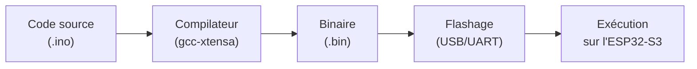

## Du texte au courant électrique

Un fichier `.ino` n'est que du texte. Pour qu'il fasse clignoter une LED, il doit traverser plusieurs transformations avant d'atteindre la puce :



Chaque étape est prise en charge par la **toolchain** — l'ensemble des outils qui transforme le code en programme exécutable.

## La toolchain Arduino-ESP32

Le framework **Arduino-ESP32** fournit trois éléments :

| Élément | Rôle |
|---|---|
| **Compilateur** (gcc pour Xtensa) | Traduit le C++ en instructions machine pour le CPU de l'ESP32-S3 |
| **Core Arduino** | Bibliothèque qui définit `pinMode()`, `digitalWrite()`, `analogRead()`… |
| **Uploader** (esptool) | Transfère le binaire compilé vers la Flash via USB |

L'IDE (Arduino IDE ou PlatformIO) orchestre ces outils en arrière-plan quand tu cliques sur *Téléverser* — mais la chaîne reste la même : **compiler → flasher → exécuter**.

## Flasher : écrire dans la mémoire persistante

Flasher, c'est écrire le **binaire** compilé (le programme traduit en instructions machine — des 0 et des 1 exécutables par la puce) dans la **Flash** du microcontrôleur (voir [Architecture d'un microcontrôleur](/workshops/microcontroleur/concepts/architecture-microcontroleur/)). Contrairement à la RAM, la Flash retient son contenu hors tension : le programme redémarre automatiquement à chaque mise sous tension, sans intervention.



## `setup()` et `loop()` — toute la structure

Un programme Arduino tient dans deux fonctions :

```cpp
void setup() {
  // Exécuté une seule fois, au démarrage
  pinMode(LED_PIN, OUTPUT);
  Serial.begin(115200);
}

void loop() {
  // Exécuté en boucle infinie, indéfiniment
  digitalWrite(LED_PIN, HIGH);
  delay(500);
  digitalWrite(LED_PIN, LOW);
  delay(500);
}
```

- `setup()` initialise le matériel (broches, ports série, périphériques) — une seule fois.
- `loop()` s'exécute en boucle infinie, du démarrage jusqu'à la coupure d'alimentation.

## Pas de système d'exploitation

Sur un ordinateur, un programme est un **processus** parmi d'autres, géré par l'OS (ordonnancement, mémoire virtuelle, arrêt propre). Sur un microcontrôleur Arduino, il n'y a **rien de tout ça** :

- Pas de multitâche par défaut — `loop()` tourne seul, en boucle, sans interruption logicielle.
- Pas de `sleep()` qui libère le CPU pour un autre programme : un `delay()` bloque **tout**, y compris la lecture des boutons.
- Pas d'arrêt propre : couper l'alimentation coupe le programme instantanément, sans sauvegarde automatique.

C'est pour cette raison que la structuration du code (game loop non bloquante, [machine à états finis](/workshops/microcontroleur/concepts/machine-etats-finis/)) devient essentielle dès que le programme gère plusieurs tâches à la fois.

## Blink, commenté ligne par ligne

Le programme le plus simple relie tous les concepts vus jusqu'ici :

```cpp
void setup() {
  pinMode(LED_BUILTIN, OUTPUT);  // configure la broche en sortie (GPIO, registre)
}

void loop() {
  digitalWrite(LED_BUILTIN, HIGH);  // écrit 3,3 V sur la broche (registre)
  delay(500);                       // bloque le CPU 500 ms (pas d'OS pour faire autre chose)
  digitalWrite(LED_BUILTIN, LOW);   // écrit 0 V sur la broche
  delay(500);
}
```

- `pinMode` et `digitalWrite` écrivent dans des **registres** ([Architecture d'un microcontrôleur](/workshops/microcontroleur/concepts/architecture-microcontroleur/)).
- La broche bascule entre deux **niveaux logiques** ([GPIO & monde numérique](/workshops/microcontroleur/concepts/gpio-monde-numerique/)).
- `delay()` bloque le CPU car il n'y a **pas d'OS** pour exécuter autre chose pendant ce temps.
- Ce même code, une fois compilé et flashé, tourne en **boucle infinie** tant que la carte est alimentée.

## Résumé

- Chaîne complète : code source → compilation (toolchain) → flashage (Flash) → exécution.
- Arduino-ESP32 fournit le compilateur, le core (`pinMode`, `digitalWrite`…) et l'uploader.
- `setup()` s'exécute une fois ; `loop()` tourne en boucle infinie jusqu'à la coupure d'alimentation.
- Pas de système d'exploitation : pas de multitâche, `delay()` bloque tout le programme.
- Le Blink relie architecture, GPIO et absence d'OS en quatre lignes de code.
