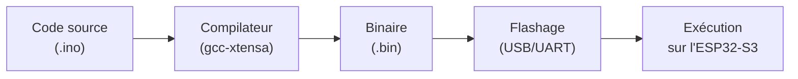

## Du clavier à la LED

Tu sais maintenant de quoi un microcontrôleur est fait et comment il parle au monde. Reste la question la plus concrète : quand tu écris du code et que tu cliques sur « Téléverser », que se passe-t-il *réellement* entre ton clavier et la LED qui se met à clignoter ?

Ce concept suit ce voyage de bout en bout — du texte que tu tapes jusqu'aux électrons qui parcourent la puce.

**À la fin de ce concept, tu sauras :**

- suivre le trajet code → compilation → flash → exécution ;
- comprendre `setup()`/`loop()` et l'absence de système d'exploitation ;
- éviter un `delay()` bloquant grâce à `millis()`.

## Du texte au courant électrique

Un fichier `.ino` n'est que du texte. Pour qu'il fasse clignoter une LED, il doit traverser plusieurs transformations avant d'atteindre la puce :



Chaque étape est prise en charge par la **toolchain** — l'ensemble des outils qui transforme le code en programme exécutable.

## La toolchain Arduino-ESP32

Le framework **Arduino-ESP32** fournit trois éléments :

| Élément | Rôle |
|---|---|
| **Compilateur** (gcc pour Xtensa) | Traduit le C++ en instructions machine pour le CPU de l'ESP32-S3 |
| **Core Arduino** | Bibliothèque qui définit `pinMode()`, `digitalWrite()`, `analogRead()`… |
| **Uploader** (esptool) | Transfère le binaire compilé vers la Flash via USB |

L'IDE (Arduino IDE ou PlatformIO) orchestre ces outils en arrière-plan quand tu cliques sur *Téléverser* — mais la chaîne reste la même : **compiler → flasher → exécuter**.

## Flasher : écrire dans la mémoire persistante

Flasher, c'est écrire le **binaire** compilé (le programme traduit en instructions machine — des 0 et des 1 exécutables par la puce) dans la **Flash** du microcontrôleur (voir [Architecture d'un microcontrôleur](/workshops/microcontroleur/concepts/architecture-microcontroleur/)). Contrairement à la RAM, la Flash retient son contenu hors tension : le programme redémarre automatiquement à chaque mise sous tension, sans intervention.



## Au reset : la séquence de démarrage

Entre la mise sous tension et l'exécution de ton `setup()`, l'ESP32-S3 traverse plusieurs étapes automatiques :

1. **ROM bootloader** — un petit programme gravé en usine dans la puce démarre. Il lit les broches de *strapping* (dont GPIO0) pour décider : démarrage normal, ou **mode téléversement** (attente d'un flash par USB/UART).
2. **Bootloader de second niveau** — chargé depuis la Flash, il initialise l'horloge et la mémoire, puis choisit la partition applicative à lancer.
3. **Ton application** — enfin, le code compilé s'exécute : `setup()` une fois, puis `loop()` en boucle.

C'est ce mécanisme qui explique le bouton **BOOT** : le maintenir enfoncé au reset force l'étape 1 en mode téléversement.

## `setup()` et `loop()` — toute la structure

Un programme Arduino tient dans deux fonctions :

```cpp
void setup() {
  // Exécuté une seule fois, au démarrage
  pinMode(LED_PIN, OUTPUT);
  Serial.begin(115200);
}

void loop() {
  // Exécuté en boucle infinie, indéfiniment
  digitalWrite(LED_PIN, HIGH);
  delay(500);
  digitalWrite(LED_PIN, LOW);
  delay(500);
}
```

- `setup()` initialise le matériel (broches, ports série, périphériques) — une seule fois.
- `loop()` s'exécute en boucle infinie, du démarrage jusqu'à la coupure d'alimentation.

## Pas de système d'exploitation

Sur un ordinateur, un programme est un **processus** parmi d'autres, géré par l'OS (ordonnancement, mémoire virtuelle, arrêt propre). Sur un microcontrôleur Arduino, il n'y a **rien de tout ça** :

- Pas de multitâche par défaut — `loop()` tourne seul, en boucle, sans interruption logicielle.
- Pas de `sleep()` qui libère le CPU pour un autre programme : un `delay()` bloque **tout**, y compris la lecture des boutons.
- Pas d'arrêt propre : couper l'alimentation coupe le programme instantanément, sans sauvegarde automatique.

C'est pour cette raison que la structuration du code (game loop non bloquante, [machine à états finis](/workshops/microcontroleur/concepts/machine-etats-finis/)) devient essentielle dès que le programme gère plusieurs tâches à la fois.

## Faire plusieurs choses à la fois — `millis()`

Le défaut de `delay()` : pendant qu'il attend, **rien d'autre ne s'exécute**. Impossible de lire un bouton, rafraîchir un écran et faire clignoter une LED « en même temps » avec des `delay()`.

La solution est de ne jamais bloquer : au lieu d'attendre, on **regarde l'heure**. `millis()` renvoie le nombre de millisecondes écoulées depuis le démarrage. En mémorisant la date de la dernière action, on décide s'il est temps d'agir — sans jamais figer le programme.

```cpp
unsigned long dernierClignotement = 0;
const unsigned long INTERVALLE = 500;  // ms
int etatLed = LOW;

void loop() {
  // ... ici, le reste du programme tourne librement (boutons, écran…)

  if (millis() - dernierClignotement >= INTERVALLE) {
    dernierClignotement = millis();
    etatLed = !etatLed;
    digitalWrite(LED_PIN, etatLed);
  }
}
```

Ce motif — comparer `millis()` à une date mémorisée — est le fondement de la **game loop non bloquante** et se combine naturellement avec la [machine à états finis](/workshops/microcontroleur/concepts/machine-etats-finis/).



## Blink, commenté ligne par ligne

Le programme le plus simple relie tous les concepts vus jusqu'ici :

```cpp
void setup() {
  pinMode(LED_BUILTIN, OUTPUT);  // configure la broche en sortie (GPIO, registre)
}

void loop() {
  digitalWrite(LED_BUILTIN, HIGH);  // écrit 3,3 V sur la broche (registre)
  delay(500);                       // bloque le CPU 500 ms (pas d'OS pour faire autre chose)
  digitalWrite(LED_BUILTIN, LOW);   // écrit 0 V sur la broche
  delay(500);
}
```

- `pinMode` et `digitalWrite` écrivent dans des **registres** ([Architecture d'un microcontrôleur](/workshops/microcontroleur/concepts/architecture-microcontroleur/)).
- La broche bascule entre deux **niveaux logiques** ([GPIO & monde numérique](/workshops/microcontroleur/concepts/gpio-monde-numerique/)).
- `delay()` bloque le CPU car il n'y a **pas d'OS** pour exécuter autre chose pendant ce temps.
- Ce même code, une fois compilé et flashé, tourne en **boucle infinie** tant que la carte est alimentée.

## Ajouter une bibliothèque

Rares sont les projets qui n'utilisent que le core Arduino : un écran, un capteur ou un servo s'appuient sur une **bibliothèque** tierce. On ne copie pas son code — on la déclare, et l'outil la télécharge :

- **Arduino IDE** : menu *Croquis → Inclure une bibliothèque → Gérer les bibliothèques*, puis rechercher par nom.
- **PlatformIO** : ajouter la dépendance dans `platformio.ini` :

```ini
lib_deps =
    bodmer/TFT_eSPI
    madhephaestus/ESP32Servo
```

Ensuite, un `#include <...>` dans le code suffit à utiliser la bibliothèque.

## Déboguer avec le moniteur série

Le moniteur série est l'outil de débogage n°1 : `Serial.println()` affiche l'état du programme en direct. Encore faut-il que les deux extrémités parlent à la **même vitesse**.



## Quiz express

**1. Quelles étapes transforment un `.ino` en programme qui s'exécute sur la puce ?**

<details><summary>Voir la réponse</summary>Compilation (toolchain) → binaire → flashage dans la Flash → exécution.</details>

**2. Pourquoi éviter `delay()` dans une `loop()` qui gère plusieurs tâches ?**

<details><summary>Voir la réponse</summary>`delay()` bloque tout le programme pendant l'attente ; on utilise `millis()` pour agir sans bloquer.</details>

**3. Que fait le ROM bootloader au reset ?**

<details><summary>Voir la réponse</summary>Il lit les broches de strapping (dont GPIO0) pour choisir entre démarrage normal et mode téléversement.</details>

## Pour aller plus loin

- [Chaîne d'outils & premier Blink](/workshops/microcontroleur/tutorials/toolchain-blink/)
- [Le port série sous VS Code](/docs/tutorials/electronics/vscode-port-serie/)

## Résumé

- Chaîne complète : code source → compilation (toolchain) → flashage (Flash) → exécution.
- Arduino-ESP32 fournit le compilateur, le core (`pinMode`, `digitalWrite`…) et l'uploader.
- `setup()` s'exécute une fois ; `loop()` tourne en boucle infinie jusqu'à la coupure d'alimentation.
- Au reset : ROM bootloader (lit le strapping) → bootloader de second niveau → application (`setup`/`loop`).
- Pas de système d'exploitation : pas de multitâche, `delay()` bloque tout le programme.
- Pour faire avancer plusieurs tâches en parallèle : comparer `millis()` à une date mémorisée plutôt qu'utiliser `delay()`.
- Le Blink relie architecture, GPIO et absence d'OS en quatre lignes de code.
- On ajoute une **bibliothèque** via le gestionnaire (Arduino IDE) ou `lib_deps` (PlatformIO), puis un `#include`.
- Débogage : `Serial.println()` + un moniteur série au **même baud** que `Serial.begin()`.
