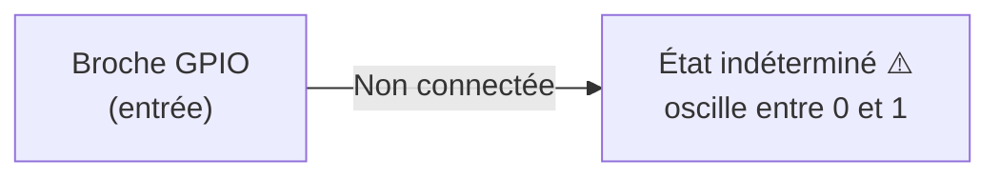

## Le numérique, c'est quoi ?

Le monde numérique ne connaît que **deux états** : `0` ou `1`, `LOW` ou `HIGH`, `0 V` ou `3,3 V`. Tout signal intermédiaire est interprété selon un seuil.

Sur l'ESP32-S3 (logique **3,3 V**) :

| État | Tension | Arduino |
|---|---|---|
| LOW | 0 V | `0` / `false` / `LOW` |
| HIGH | 3,3 V | `1` / `true` / `HIGH` |



## GPIO — General Purpose Input/Output

Chaque broche GPIO peut être configurée en **entrée** ou en **sortie** par le logiciel.

```cpp
pinMode(LED_PIN, OUTPUT);   // broche configurée en sortie
pinMode(BTN_PIN, INPUT);    // broche configurée en entrée
```

### Sortie — piloter une LED

Une broche en sortie peut sourcer ou drainer du courant pour piloter un composant.

```cpp
digitalWrite(LED_PIN, HIGH);  // LED allumée (3,3 V sur la broche)
digitalWrite(LED_PIN, LOW);   // LED éteinte (0 V)
```

**Courant maximal par broche ESP32-S3 : ~40 mA.** En pratique, limiter à 12 mA avec une résistance série.

Calcul de la résistance pour une LED rouge (Vf ≈ 2 V, I = 10 mA) :

$$R = \frac{V_{alim} - V_f}{I} = \frac{3{,}3 - 2}{0{,}01} = 130\ \Omega$$

Valeur normalisée : **150 Ω** (série E12).

### Entrée — lire un bouton

Une broche en entrée mesure le niveau de tension présent sur la broche.

```cpp
int etat = digitalRead(BTN_PIN);  // retourne HIGH ou LOW
```

## Pull-up, pull-down & état flottant

### Le problème de l'état flottant

Une broche en entrée non connectée à rien est dans un **état flottant** : sa tension est indéterminée, elle peut lire `HIGH` ou `LOW` de façon aléatoire selon les interférences électromagnétiques.



### La solution : résistance de rappel

Une résistance de rappel (**pull**) force la broche à un niveau défini quand aucun signal n'est appliqué.

#### Pull-up — repos à HIGH

La résistance relie la broche au **+3,3 V**. Au repos, la broche lit `HIGH`. Quand le bouton est pressé (connexion à GND), elle passe à `LOW`.

```text
3,3 V ──┬── R (10 kΩ) ──┐
        │               │
        └── Bouton ──── GND
                        │
                    Broche GPIO
```

#### Pull-down — repos à LOW

La résistance relie la broche au **GND**. Au repos, la broche lit `LOW`. Quand le bouton est pressé (connexion à +3,3 V), elle passe à `HIGH`.

### Pull-up interne de l'ESP32-S3

L'ESP32-S3 intègre des résistances de pull-up (et pull-down) **en interne**, activables par logiciel — pas besoin de résistance externe dans la plupart des cas.

```cpp
pinMode(BTN_PIN, INPUT_PULLUP);    // pull-up interne activé (~45 kΩ)
// ou
pinMode(BTN_PIN, INPUT_PULLDOWN);  // pull-down interne activé
```

Avec `INPUT_PULLUP` : le bouton doit connecter la broche à **GND** pour être détecté (logique inversée : `LOW` = pressé).

## Courant maximum et protection des broches

| Limite | Valeur ESP32-S3 |
|---|---|
| Courant max par broche | 40 mA (recommandé : ≤ 12 mA) |
| Tension max en entrée | **3,3 V** |
| Courant total GPIO | 1,2 A (toutes broches cumulées) |

Ne jamais connecter une charge inductive (moteur, relais) directement sur un GPIO — toujours utiliser un transistor ou un driver.

## Résumé

- GPIO = broche configurable en entrée (`INPUT`) ou sortie (`OUTPUT`).
- Sortie : produit `0 V` (LOW) ou `3,3 V` (HIGH) — maximum ~12 mA.
- Entrée sans résistance de rappel → **état flottant** (lectures aléatoires).
- `INPUT_PULLUP` / `INPUT_PULLDOWN` activent la résistance interne de l'ESP32-S3.
- Avec pull-up : bouton branché entre GPIO et GND → `LOW` quand pressé.
