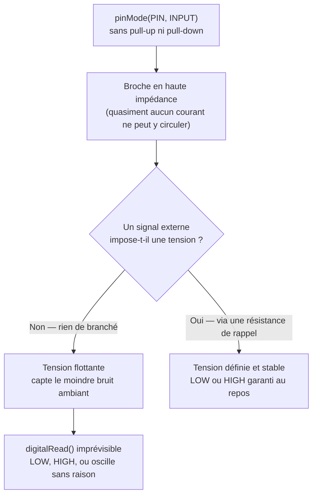
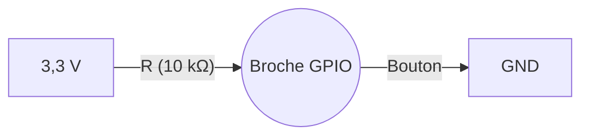
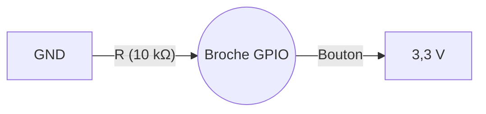

## Toucher le monde réel

Jusqu'ici, le microcontrôleur réfléchissait dans son coin. Mais une puce qui ne fait que calculer ne sert à rien : pour être utile, elle doit **agir** sur le monde (allumer une LED, faire tourner un moteur) et le **percevoir** (savoir si tu appuies sur un bouton).

Ce contact avec le monde physique passe par les **broches** de la puce — ces petites pattes métalliques alignées sur les bords de la carte. Les plus polyvalentes s'appellent les **GPIO**, et ce concept est consacré aux plus simples d'entre elles : celles qui ne manipulent que du **tout-ou-rien**, comme un interrupteur mural qu'on bascule entre allumé et éteint. Pas de demi-mesure — et c'est justement ce qui rend le numérique si fiable.

**À la fin de ce concept, tu sauras :**

- configurer une broche en entrée ou en sortie ;
- éviter l'état flottant avec un pull-up ou un pull-down ;
- lire un bouton proprement (anti-rebond) et repérer les broches à éviter.

## Le numérique, c'est quoi ?

Le monde numérique ne connaît que **deux états** : `0` ou `1`, `LOW` ou `HIGH`, `0 V` ou `3,3 V`. Tout signal intermédiaire est interprété selon un seuil.

Sur l'ESP32-S3 (logique **3,3 V**) :

| État | Tension | Arduino |
|---|---|---|
| LOW | 0 V | `0` / `false` / `LOW` |
| HIGH | 3,3 V | `1` / `true` / `HIGH` |



## GPIO — General Purpose Input/Output

Chaque broche GPIO (*General Purpose Input/Output*, broche d'entrée/sortie à usage général) peut être configurée en **entrée** ou en **sortie** par le logiciel.

```cpp
pinMode(LED_PIN, OUTPUT);   // broche configurée en sortie
pinMode(BTN_PIN, INPUT);    // broche configurée en entrée
```

### Sortie — piloter une LED

Une broche en sortie peut **sourcer ou drainer** du courant (le fournir ou l'absorber) pour piloter un composant.

```cpp
digitalWrite(LED_PIN, HIGH);  // LED allumée (3,3 V sur la broche)
digitalWrite(LED_PIN, LOW);   // LED éteinte (0 V)
```

**Courant maximal par broche ESP32-S3 : ~40 mA.** En pratique, limiter à 12 mA avec une résistance série.

Calcul de la résistance pour une LED rouge (Vf, la tension de seuil de la LED, ≈ 2 V ; I = 10 mA) :

$$R = \frac{V_{alim} - V_f}{I} = \frac{3{,}3 - 2}{0{,}01} = 130\ \Omega$$

Valeur normalisée : **150 Ω** (série E12).

### Push-pull vs open-drain — deux façons de piloter une sortie

Par défaut, `OUTPUT` configure la broche en **push-pull** : deux transistors internes permettent de tirer activement la broche à `HIGH` ou à `LOW`. C'est le mode utilisé jusqu'ici.

Il existe un second mode, **open-drain** : la broche ne peut **que** tirer vers `LOW` (un seul transistor, côté masse). Pour lire ou produire un `HIGH`, il faut une résistance de tirage (interne ou externe) qui « relâche » la broche vers `HIGH` quand personne ne la tire vers le bas.

```cpp
pinMode(PIN, OUTPUT_OPEN_DRAIN);  // la broche ne peut que tirer vers 0 V
digitalWrite(PIN, LOW);           // tire activement à 0 V
digitalWrite(PIN, HIGH);          // relâche la broche (haute impédance)
```

| | Push-pull (`OUTPUT`) | Open-drain (`OUTPUT_OPEN_DRAIN`) |
|---|---|---|
| Peut tirer vers HIGH | Oui, activement | Non — nécessite un pull-up |
| Peut tirer vers LOW | Oui, activement | Oui, activement |
| Usage typique | LED, moteur, sortie numérique classique | Bus partagé (I2C), interfaçage avec un niveau logique différent |

{% include message.html title="Pourquoi l'I2C utilise l'open-drain" message="Sur un bus I2C, plusieurs périphériques partagent les mêmes fils SDA/SCL. Si un seul poussait activement vers HIGH pendant qu'un autre tire vers LOW, ce serait un court-circuit. En open-drain, chacun ne peut que tirer vers LOW ou relâcher — jamais imposer un HIGH — d'où la résistance de pull-up partagée sur le bus (voir le concept [Les bus de communication](/workshops/microcontroleur/concepts/bus-communication/))." status="is-info" icon="fas fa-info-circle" %}

### Entrée — lire un bouton

Une broche en entrée mesure le niveau de tension présent sur la broche.

```cpp
int etat = digitalRead(BTN_PIN);  // retourne HIGH ou LOW
```

## Pull-up, pull-down & état flottant

### Le problème de l'état flottant

Une broche en entrée non connectée à rien est dans un **état flottant** : sa tension est indéterminée, elle peut lire `HIGH` ou `LOW` de façon aléatoire selon les interférences électromagnétiques.



Une broche en haute impédance n'a presque aucune résistance interne : la moindre interférence électromagnétique environnante (un câble voisin, le secteur 50 Hz, ta propre main qui s'approche) suffit à faire basculer sa lecture — d'où le terme « flottant » : rien ne fixe sa tension à une valeur précise.

### La solution : résistance de rappel

Une résistance de rappel (**pull**) force la broche à un niveau défini quand aucun signal n'est appliqué.

#### Pull-up — repos à HIGH

La résistance relie la broche au **+3,3 V**. Au repos, la broche lit `HIGH`. Quand le bouton est pressé (connexion à GND), elle passe à `LOW`.



#### Pull-down — repos à LOW

La résistance relie la broche au **GND**. Au repos, la broche lit `LOW`. Quand le bouton est pressé (connexion à +3,3 V), elle passe à `HIGH`.



### Pull-up interne de l'ESP32-S3

L'ESP32-S3 intègre des résistances de pull-up (et pull-down) **en interne**, activables par logiciel — pas besoin de résistance externe dans la plupart des cas.

```cpp
pinMode(BTN_PIN, INPUT_PULLUP);    // pull-up interne activé (~45 kΩ)
// ou
pinMode(BTN_PIN, INPUT_PULLDOWN);  // pull-down interne activé
```

Avec `INPUT_PULLUP` : le bouton doit connecter la broche à **GND** pour être détecté (logique inversée : `LOW` = pressé).

## Lire un bouton de façon fiable — l'anti-rebond

Quand tu presses un bouton mécanique, le contact ne s'établit pas net : les lamelles métalliques **rebondissent** pendant quelques millisecondes, générant une rafale de `HIGH`/`LOW` avant de se stabiliser. Un `digitalRead()` naïf voit alors *plusieurs* appuis là où tu n'en as fait qu'un.

La parade la plus simple est logicielle : après un changement d'état, on **ignore** les lectures pendant un court délai (20 à 50 ms), grâce à `millis()` (le nombre de millisecondes écoulées depuis le démarrage), le temps que le contact se stabilise.

```cpp
const unsigned long ANTIREBOND = 30;   // ms
int dernierEtat = HIGH;
unsigned long dernierChangement = 0;

void loop() {
  int etat = digitalRead(BTN_PIN);      // INPUT_PULLUP : LOW = pressé

  if (etat != dernierEtat) {
    dernierChangement = millis();       // le signal vient de bouger
    dernierEtat = etat;
  }

  if (millis() - dernierChangement > ANTIREBOND && etat == LOW) {
    // appui confirmé : stable depuis 30 ms
  }
}
```



## GPIO matrix — une broche n'est pas toujours un simple GPIO

Au-delà de `digitalRead()`/`digitalWrite()`, une broche peut être prise en charge par un périphérique — UART, SPI, I2C, PWM (LEDC)... Sur beaucoup de microcontrôleurs, chaque fonction est câblée en dur sur des broches précises (« fonction alternative » fixe).

L'ESP32-S3 est plus flexible : une **GPIO matrix** interne permet de router presque n'importe quel signal numérique de périphérique vers presque n'importe quelle broche, par logiciel.

```cpp
Serial1.begin(115200, SERIAL_8N1, 16, 17);  // UART1 routé sur GPIO16 (RX) / GPIO17 (TX)
// une autre paire de broches fonctionnerait tout aussi bien
```



## Toutes les broches ne se valent pas

Malgré la souplesse de la GPIO matrix, certaines broches ont un **rôle réservé** au démarrage ou au fonctionnement interne de l'ESP32-S3. Les détourner en GPIO ordinaire peut empêcher la carte de démarrer, de se flasher ou de communiquer en USB.

| Broches | Rôle réservé | Précaution |
|---|---|---|
| **GPIO 0, 3, 45, 46** | *Strapping* — lues au reset pour choisir le mode de boot | Éviter, ou ne rien y imposer comme niveau au démarrage |
| **GPIO 19, 20** | USB natif (D− / D+) | Éviter si tu utilises l'USB (flash, port série) |
| **GPIO 43, 44** | UART0 par défaut (TX / RX du moniteur série) | Libres si le port série n'est pas utilisé, sinon à éviter |
| **GPIO 26–32** | Reliées à la Flash SPI interne | **Ne jamais utiliser** |
| **GPIO 33–37** | Utilisées par la PSRAM sur les modules « octal » | Éviter sur les modules équipés de PSRAM |



## Courant maximum et protection des broches

| Limite | Valeur ESP32-S3 |
|---|---|
| Courant max par broche | 40 mA (recommandé : ≤ 12 mA) |
| Tension max en entrée | **3,3 V** |

Ne jamais connecter une charge inductive (moteur, relais — une charge qui stocke de l'énergie magnétique et renvoie des pics de tension à la coupure) directement sur un GPIO — toujours utiliser un transistor ou un **driver** (circuit de puissance intermédiaire).

## Quiz express

**1. Une entrée non connectée lit des valeurs aléatoires. Comment y remédier ?**

<details><summary>Voir la réponse</summary>Avec une résistance de rappel (pull-up ou pull-down), interne (`INPUT_PULLUP`) ou externe, qui fixe un niveau défini au repos.</details>

**2. Avec `INPUT_PULLUP`, quel niveau lit-on quand le bouton est pressé ?**

<details><summary>Voir la réponse</summary>`LOW` (logique inversée) : le bouton relie la broche à GND.</details>

**3. Pourquoi un `digitalRead()` compte-t-il parfois plusieurs appuis pour un seul ?**

<details><summary>Voir la réponse</summary>À cause du rebond mécanique du contact ; on le filtre par un anti-rebond logiciel (avec `millis()`).</details>

## Pour aller plus loin

- [Piloter les GPIO de l'ESP32](/docs/tutorials/electronics/esp32-gpio/)
- [Entrées : boutons & joystick](/workshops/microcontroleur/tutorials/entrees-boutons-joystick/)

## Résumé

- GPIO = broche configurable en entrée (`INPUT`) ou sortie (`OUTPUT`).
- Sortie : produit `0 V` (LOW) ou `3,3 V` (HIGH) — maximum ~12 mA.
- Sortie **push-pull** (défaut) tire activement vers HIGH et LOW ; **open-drain** ne tire que vers LOW (utile pour un bus partagé comme l'I2C).
- Entrée sans résistance de rappel → **état flottant** (lectures aléatoires).
- `INPUT_PULLUP` / `INPUT_PULLDOWN` activent la résistance interne de l'ESP32-S3.
- Avec pull-up : bouton branché entre GPIO et GND → `LOW` quand pressé.
- La **GPIO matrix** route les périphériques numériques (UART, SPI, I2C, PWM) vers presque n'importe quelle broche — sauf l'ADC, câblé en dur.
- Un bouton mécanique **rebondit** : filtrer avec un anti-rebond logiciel (`millis()`) pour ne pas compter plusieurs appuis.
- Certaines broches sont **réservées** (strapping, Flash SPI, USB) — vérifier le brochage de la carte avant de câbler.
