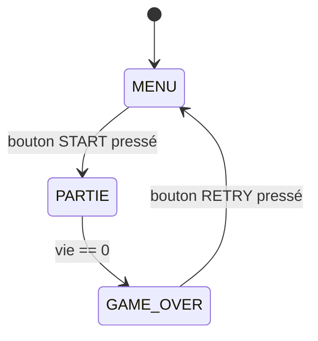
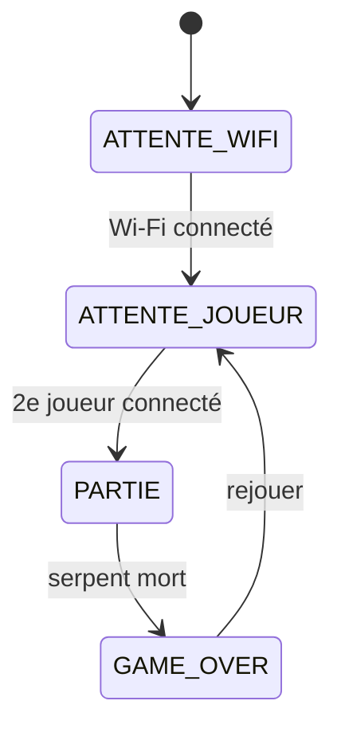

## Quand le code devient un plat de spaghettis

Ton programme grossit. Une LED qui clignote tient en quatre lignes ; mais un jeu, lui, a plusieurs moments de vie - un menu d'accueil, une partie en cours, un écran de fin. Gérer ces phases « à la main » transforme vite le code en plat de spaghettis : des variables un peu partout, des `if/else` qui s'emmêlent, et des bugs difficiles à traquer.

La **machine à états finis** (FSM) est l'outil classique de l'embarqué pour garder les idées claires. Commençons par voir ce qui se passe sans elle.

**À la fin de ce concept, tu sauras :**

- reconnaître quand une machine à états finis est utile ;
- l'implémenter avec un `enum` et un `switch` ;
- gérer des transitions temporisées et des actions d'entrée.

## Le problème sans FSM

Un programme embarqué simple enchaîne les actions ligne par ligne. Dès qu'il faut gérer plusieurs **phases** (menu d'accueil → partie en cours → game over), le code se remplit de `if/else` imbriqués et de variables booléennes qui s'accumulent :

```cpp
bool enPartie = false;
bool gameOver = false;
bool menuActif = true;
// ...et ça empire à chaque nouvelle phase
```

La **machine à états finis** (FSM - *Finite State Machine*) est la solution classique de l'embarqué pour ce problème.

## Principe d'une FSM

Une FSM est définie par :

- un ensemble fini d'**états** (ex : `MENU`, `PARTIE`, `GAME_OVER`)
- des **transitions** entre états déclenchées par des événements (bouton pressé, score atteint…)
- un seul **état actif** à la fois



## Implémentation avec un `enum` + `switch`

### 1 - Déclarer les états

```cpp
enum EtatJeu {
  MENU,
  PARTIE,
  GAME_OVER
};

EtatJeu etat = MENU;  // état initial
```

### 2 - La game loop avec `switch`

```cpp
void loop() {
  lireEntrees();        // lire boutons / joystick

  switch (etat) {

    case MENU:
      afficherMenu();
      if (boutonStart()) {
        initialiserPartie();
        etat = PARTIE;  // transition
      }
      break;

    case PARTIE:
      mettreAJourJeu();
      afficherJeu();
      if (vieJoueur == 0) {
        etat = GAME_OVER;  // transition
      }
      break;

    case GAME_OVER:
      afficherGameOver();
      if (boutonRetry()) {
        etat = MENU;  // transition
      }
      break;
  }
}
```

Chaque `case` gère **un seul état** : ce qu'il affiche, ce qu'il fait, et vers quel état il peut basculer.



## Pourquoi c'est fondamental en embarqué

### Pas d'OS, pas de processus

Sur un µC Arduino, il n'y a **pas de système d'exploitation**. Pas de threads (tâches exécutées en parallèle), pas de `sleep()` bloquant sans conséquence. Le `loop()` s'exécute en boucle infinie - toutes les décisions sur ce qu'il faut faire à chaque instant passent par le code.

La FSM remplace ce qu'un OS ferait autrement : elle décide quel « mode » est actif et ce qu'il faut exécuter.

### La FSM prépare le projet réseau

Dans le projet Snake multijoueur, la FSM du jeu accueillera des **états réseau** supplémentaires :



La structure `switch(etat)` est la même - on ajoute juste des états.

## FSM vs variables booléennes

| Approche | Lisibilité | Extensibilité | Bugs typiques |
|---|---|---|---|
| Booléens `enPartie`, `gameOver`… | Faible (états implicites) | Difficile | États contradictoires (`enPartie && gameOver == true`) |
| **FSM avec `enum`** | Élevée (états explicites) | Facile (ajouter un `case`) | Aucun état contradictoire possible |

## Aller plus loin : actions d'entrée et transitions temporisées

Deux raffinements rendent une FSM plus expressive (on suppose une variable globale `unsigned long entreeEtat;` qui mémorise l'instant d'entrée dans l'état courant).

**Action d'entrée (*onEnter*).** Certaines choses ne doivent se faire qu'*une fois*, au moment où l'on bascule dans un état (réinitialiser le score, afficher un écran). On les exécute donc **au moment de la transition**, pas à chaque tour de boucle :

```cpp
void allerVers(EtatJeu nouvel) {
  etat = nouvel;
  entreeEtat = millis();                        // date d'entrée dans l'état
  if (nouvel == PARTIE)    initialiserPartie(); // action d'entrée
  if (nouvel == GAME_OVER) afficherGameOver();  // exécutée une seule fois
}
```

**Transition temporisée.** Un état peut basculer tout seul après un certain temps - un écran « GAME OVER » qui revient au menu après 3 secondes. On combine la FSM avec `millis()` (voir [Du matériel au logiciel](/workshops/microcontroleur/concepts/du-materiel-au-logiciel/)) : on compare l'heure actuelle à la date d'entrée dans l'état.

```cpp
case GAME_OVER:
  if (millis() - entreeEtat > 3000) {  // 3 s écoulées
    allerVers(MENU);
  }
  break;
```

## Exercice - dessiner la FSM du Pong

Avant de coder le TD4, dessine sur papier la FSM du Pong :

- Quels sont les états ? (`MENU`, `PARTIE`, `PAUSE` ?, `GAME_OVER`)
- Quels événements déclenchent les transitions ?
- Quel est l'état initial ?

Compare ensuite ta FSM avec celle du groupe - les différences de conception sont souvent révélatrices.

## Pour aller plus loin

- [Collisions & FSM : le Pong](/workshops/microcontroleur/tutorials/collisions-fsm-pong/) - mettre la FSM en œuvre dans un jeu

## Résumé

- Une FSM = états + transitions + un seul état actif à la fois.
- Implémentation Arduino : `enum` pour les états, `switch(etat)` dans la `loop()`.
- Chaque `case` gère l'affichage, la logique et les transitions de son état.
- La FSM élimine les booléens incompatibles et rend le code extensible.
- Une FSM se combine avec `millis()` pour des **transitions temporisées**, et avec des **actions d'entrée** exécutées une seule fois par changement d'état.
- Dans ce projet : FSM du jeu (TD4) → étendue aux états réseau (Projet).
