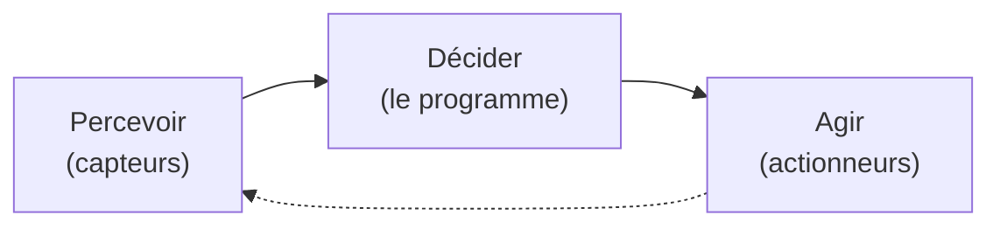

## Tu en côtoies des dizaines sans le savoir

Un **microcontrôleur**, c'est un ordinateur complet réduit à la taille d'un ongle, posé sur une seule petite puce. Pas d'écran, pas de clavier, pas de ventilateur qui ronronne juste l'essentiel pour faire *une* chose, et la faire bien.

Tu en as sûrement une dizaine à portée de main en ce moment :

- le **micro-ondes** qui compte les secondes et fait tourner le plateau,
- la **machine à laver** qui enchaîne lavage, rinçage, essorage,
- la **télécommande**, les **écouteurs sans fil**, la **manette** de jeu,
- la **trottinette électrique**, le **thermostat**, le **jouet** qui clignote,
- et par dizaines dans une voiture (vitres, clignotants, airbags…).

Aucun de ces objets n'a besoin d'un « vrai » ordinateur : ils ont besoin d'une petite puce bon marché, robuste, qui démarre instantanément et fait sa tâche en boucle. C'est exactement le rôle d'un microcontrôleur.

**À la fin de ce concept, tu sauras :**

- ce qu'est un microcontrôleur et où on en trouve au quotidien ;
- décrire son cycle *percevoir → décider → agir* ;
- ce qui le distingue d'un ordinateur classique.

## Percevoir, décider, agir

Peu importe l'objet, un microcontrôleur fait toujours la même boucle en trois temps :

1. **Percevoir** - il lit des **capteurs** : un bouton pressé, une température, une distance, la lumière ambiante…
2. **Décider** - il exécute son **programme** : une suite d'instructions que tu écris, qui dit quoi faire selon ce qui a été perçu.
3. **Agir** - il commande des **actionneurs** : allumer une LED, faire tourner un moteur, émettre un son, afficher un texte…

Un exemple concret : un **thermostat** *perçoit* la température, *décide* « il fait trop froid », puis *agit* en allumant le chauffage. Puis il recommence, indéfiniment. Tout l'atelier consiste à écrire la partie « décider ».



## En quoi c'est différent d'un ordinateur classique ?

Ton ordinateur portable est une machine polyvalente : il fait *tout* (naviguer, jouer, écrire), mais il est cher, gourmand en énergie et met du temps à démarrer. Un microcontrôleur fait le pari inverse.

| | Ordinateur classique | Microcontrôleur |
|---|---|---|
| **Tâches** | Des milliers, en même temps | Une seule, en boucle |
| **Prix** | Plusieurs centaines d'€ | Quelques euros, parfois centimes |
| **Énergie** | Se branche au secteur | Peut tenir des mois sur une pile |
| **Démarrage** | Plusieurs secondes | Instantané |
| **Écran / système** | Écran + système d'exploitation | Ni l'un ni l'autre, en général |

C'est cette **sobriété** qui le rend si présent : on peut en mettre partout, pour presque rien, sans y penser.



## Le microcontrôleur de cet atelier : l'ESP32-S3

Dans cet atelier, on utilise un microcontrôleur moderne et populaire : l'**ESP32-S3**. En plus de percevoir et d'agir, il sait aussi communiquer sans fil (Wi-Fi et Bluetooth) de quoi imaginer des objets connectés. Pas d'inquiétude si le nom ne te dit rien : on part de zéro.



## Et sous le capot ?

Tu sais maintenant *à quoi sert* un microcontrôleur et *ce qu'il fait*. La prochaine étape est d'ouvrir le capot pour voir *comment* il est fait à l'intérieur le processeur, les mémoires, les broches dans le concept [Architecture d'un microcontrôleur](/workshops/microcontroleur/concepts/architecture-microcontroleur/).

## Quiz express

**1. Un microcontrôleur peut-il faire tourner plusieurs applications comme un ordinateur ?**

Voir la réponse
Non : il est conçu pour une seule tâche, répétée en boucle c'est ce qui le rend simple, bon marché et économe.

**2. Quelles sont les trois étapes de sa boucle de fonctionnement ?**

Voir la réponse
Percevoir (capteurs) → décider (le programme) → agir (actionneurs).

**3. Qui écrit la partie « décider » ?**

Voir la réponse
Toi : sans programme, la puce reste inerte.

## Pour aller plus loin

Prêt à passer à la pratique ? Le premier tutoriel installe les outils et flashe ton tout premier programme :

- [Chaîne d'outils & premier Blink](/workshops/microcontroleur/tutorials/toolchain-blink/)

## Résumé

- Un microcontrôleur est un **ordinateur miniature complet sur une seule puce**, présent dans une foule d'objets du quotidien.
- Il fonctionne toujours en trois temps : **percevoir** (capteurs) → **décider** (le programme) → **agir** (actionneurs), en boucle.
- C'est **toi qui écris la partie « décider »** : sans programme, la puce ne fait rien.
- Comparé à un ordinateur classique, il fait **une seule tâche**, coûte peu, consomme peu et démarre instantanément.
- Dans cet atelier, on programme un **ESP32-S3**, qui sait en plus communiquer sans fil.
