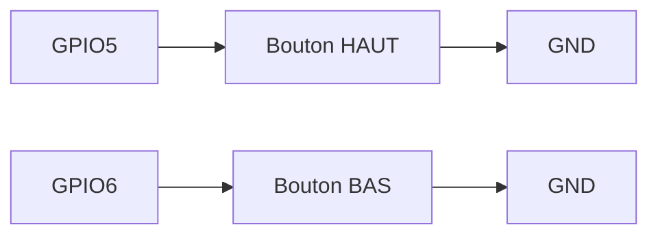
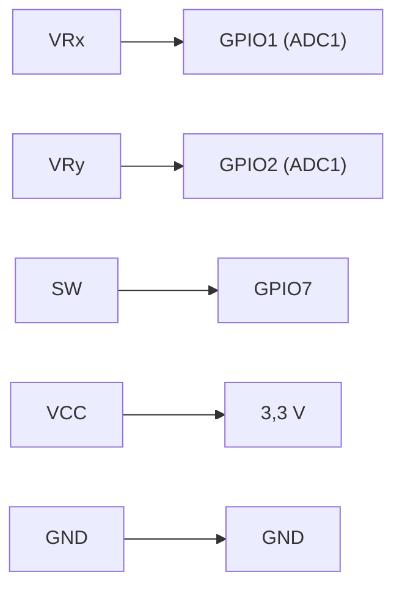

## Entrées : boutons + joystick + série

Ce tutoriel ajoute les **entrées** du montage Pong : les deux boutons du joueur 1, et le joystick du joueur 2 (qui sert aussi de bouton START/RETRY pour le menu du jeu). Le câblage posé ici est **figé** - il ne change plus jusqu'au projet.

### Câblage figé de l'atelier

| Rôle | Broche | Type |
|---|---|---|
| Bouton joueur 1 - HAUT | GPIO5 | `INPUT_PULLUP` |
| Bouton joueur 1 - BAS | GPIO6 | `INPUT_PULLUP` |
| Joystick joueur 2 - X | GPIO1 (**ADC1**) | `analogRead` |
| Joystick joueur 2 - Y | GPIO2 (**ADC1**) | `analogRead` |
| Bouton du joystick (START/RETRY) | GPIO7 | `INPUT_PULLUP` |



### Pourquoi INPUT_PULLUP plutôt qu'une résistance externe ?

Trois modes existent pour configurer une broche en entrée :

| Mode | Comportement au repos | Câblage requis |
|---|---|---|
| `INPUT` | flottant (valeur indéterminée) | résistance externe obligatoire |
| `INPUT_PULLUP` | HIGH (tiré vers 3,3 V en interne) | bouton vers GND - **notre cas** |
| `INPUT_PULLDOWN` | LOW (tiré vers GND en interne) | bouton vers 3,3 V |

`INPUT_PULLUP` évite toute soudure de résistance sur les 3 boutons du montage. C'est pour ça que le tableau ci-dessus ne mentionne jamais de résistance sur les lignes GPIO5, GPIO6 et GPIO7.





```cpp
#define BTN_HAUT 5
#define BTN_BAS  6

void setup() {
  Serial.begin(115200);
  pinMode(BTN_HAUT, INPUT_PULLUP);
  pinMode(BTN_BAS, INPUT_PULLUP);
}
```



```cpp
bool boutonPresse(int pin) {
  if (digitalRead(pin) == LOW) {
    delay(20);                     // anti-rebond léger
    return digitalRead(pin) == LOW;
  }
  return false;
}

void loop() {
  if (boutonPresse(BTN_HAUT)) {
    Serial.println("Joueur 1 : HAUT");
  }
  if (boutonPresse(BTN_BAS)) {
    Serial.println("Joueur 1 : BAS");
  }
}
```

{% include message.html title="Un delay() qui bloque - pour l'instant, c'est acceptable" message="`delay(20)` fige tout le programme pendant 20 ms à chaque appui, y compris la lecture des autres entrées. Sans écran à rafraîchir, ça ne se voit pas encore. Le tutoriel [Écran SPI et game loop](/docs/tutorials/electronics/ecran-spi-game-loop/) introduira une **game loop non bloquante** avec `millis()` dès qu'il faudra dessiner à 60 images/seconde - retiens simplement que `delay()` est une solution provisoire, pas la bonne pratique finale." status="is-warning" icon="fas fa-exclamation-triangle" %}









Contrairement aux boutons (`0` ou `1`), les axes du joystick renvoient une **valeur continue** convertie en nombre par l'ADC 12 bits de l'ESP32-S3 - soit $2^{12} = 4096$ valeurs possibles :

| Position du stick | Tension | Valeur ADC |
|---|---|---|
| Butée gauche/bas | 0 V | 0 |
| Centre (repos) | 1,65 V | ≈ 2048 |
| Butée droite/haut | 3,3 V | 4095 |

```cpp
#define JOY_X   1
#define JOY_Y   2
#define JOY_BTN 7

void setup() {
  Serial.begin(115200);
  pinMode(JOY_BTN, INPUT_PULLUP);
  // JOY_X et JOY_Y n'ont pas besoin de pinMode : analogRead() les configure.
}

void loop() {
  int x = analogRead(JOY_X);   // 0 à 4095
  int y = analogRead(JOY_Y);   // 0 à 4095
  bool pressed = digitalRead(JOY_BTN) == LOW;

  Serial.printf("x=%d y=%d btn=%d\n", x, y, pressed);
  delay(100);
}
```





```cpp
enum Direction { CENTRE, HAUT, BAS, GAUCHE, DROITE };

Direction lireDirection() {
  int x = analogRead(JOY_X);
  int y = analogRead(JOY_Y);

  const int SEUIL_BAS  = 1500;
  const int SEUIL_HAUT = 2500;

  if (x < SEUIL_BAS)       return GAUCHE;
  if (x > SEUIL_HAUT)      return DROITE;
  if (y < SEUIL_BAS)       return BAS;
  if (y > SEUIL_HAUT)      return HAUT;
  return CENTRE;
}
```

Les seuils `1500` et `2500` découpent la plage `0-4095` en cinq zones, centrées sur la valeur de repos (≈2048) :

| Zone | Plage | Direction |
|---|---|---|
| Butée basse | `0` – `1499` | GAUCHE (X) / BAS (Y) |
| **Zone morte** | `1500` – `2500` | CENTRE |
| Butée haute | `2501` – `4095` | DROITE (X) / HAUT (Y) |

La zone morte `1500`-`2500` (large de 1000 sur les 4096 valeurs) absorbe le bruit électrique et l'imprécision mécanique du potentiomètre autour de la position de repos, sans réduire perceptiblement la course utile du stick.





```cpp
#define BTN_HAUT 5
#define BTN_BAS  6
#define JOY_X    1
#define JOY_Y    2
#define JOY_BTN  7

enum Direction { CENTRE, HAUT, BAS, GAUCHE, DROITE };

bool boutonPresse(int pin) {
  if (digitalRead(pin) == LOW) {
    delay(20);
    return digitalRead(pin) == LOW;
  }
  return false;
}

Direction lireDirection() {
  int x = analogRead(JOY_X);
  int y = analogRead(JOY_Y);

  const int SEUIL_BAS  = 1500;
  const int SEUIL_HAUT = 2500;

  if (x < SEUIL_BAS)  return GAUCHE;
  if (x > SEUIL_HAUT) return DROITE;
  if (y < SEUIL_BAS)  return BAS;
  if (y > SEUIL_HAUT) return HAUT;
  return CENTRE;
}

void setup() {
  Serial.begin(115200);
  pinMode(BTN_HAUT, INPUT_PULLUP);
  pinMode(BTN_BAS, INPUT_PULLUP);
  pinMode(JOY_BTN, INPUT_PULLUP);
}

void loop() {
  if (boutonPresse(BTN_HAUT)) Serial.println("Joueur 1 : HAUT");
  if (boutonPresse(BTN_BAS))  Serial.println("Joueur 1 : BAS");

  bool startRetry = digitalRead(JOY_BTN) == LOW;
  Serial.printf("Joueur 2 : %d (start/retry=%d)\n", lireDirection(), startRetry);

  delay(100);
}
```

## Résultat attendu

À la fin de ce tutoriel, le moniteur série doit afficher en temps réel, simultanément et sans conflit :

- `HAUT` / `BAS` quand les boutons du joueur 1 sont pressés,
- la direction détectée du joystick du joueur 2,
- l'état du bouton START/RETRY.


