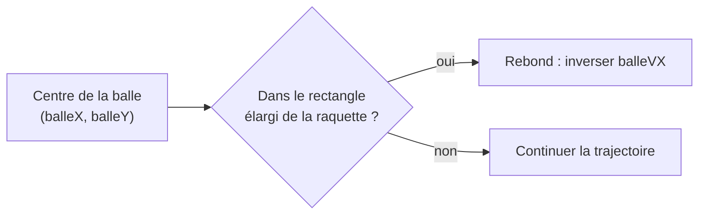
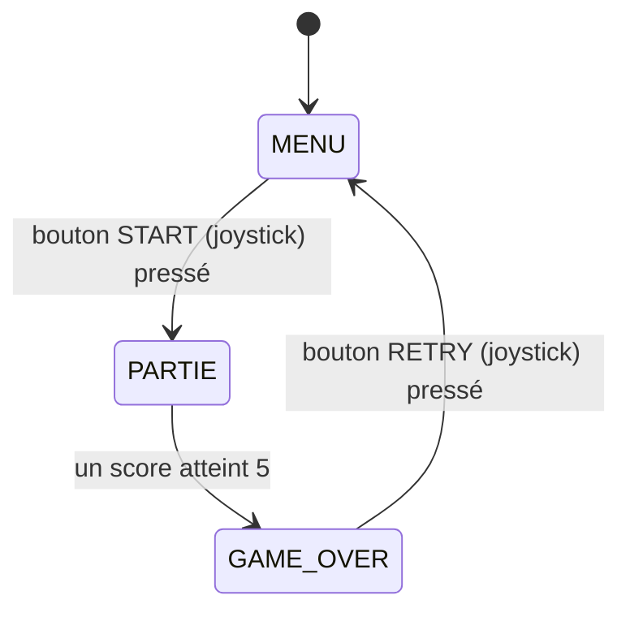

## TD4 — Animation + collisions + boutons + FSM (3h)

Dernier TD de l'atelier : ce Pong assemble tout ce qui a été construit depuis le TD1 — boutons, joystick, écran, game loop — et lui donne une **structure complète** avec un début et une fin. Aucun câblage supplémentaire n'est nécessaire.

### Structurer le code en trois blocs

À partir de maintenant, sépare systématiquement le code en trois responsabilités — c'est la structure qui sera reprise telle quelle au projet Snake :

```cpp
void loop() {
  unsigned long maintenant = millis();
  if (maintenant - dernierUpdate < INTERVALLE) return;
  dernierUpdate = maintenant;

  lireEntrees();     // boutons + joystick → variables d'intention
  mettreAJourJeu();  // logique : déplacements, collisions, score
  redessiner();      // uniquement de l'affichage, aucune logique
}
```



```cpp
int raquette1Y = 60, raquette2Y = 60;  // joueur 1 (droite), joueur 2 (gauche)
const int RAQUETTE_H = 30, RAQUETTE_W = 6;
const int VITESSE_RAQUETTE = 4;

void lireEntrees() {
  if (boutonPresse(BTN_HAUT) && raquette1Y > 0)                       raquette1Y -= VITESSE_RAQUETTE;
  if (boutonPresse(BTN_BAS)  && raquette1Y < tft.height() - RAQUETTE_H) raquette1Y += VITESSE_RAQUETTE;

  raquette2Y = map(analogRead(JOY_Y), 0, 4095, 0, tft.height() - RAQUETTE_H);
}
```



```cpp
const int BALLE_RAYON = 4;

bool collision(int balleX, int balleY, int raquetteX, int raquetteY) {
  bool dansX = balleX + BALLE_RAYON >= raquetteX && balleX - BALLE_RAYON <= raquetteX + RAQUETTE_W;
  bool dansY = balleY + BALLE_RAYON >= raquetteY && balleY - BALLE_RAYON <= raquetteY + RAQUETTE_H;
  return dansX && dansY;
}
```



```cpp
void mettreAJourJeu() {
  balleX += balleVX;
  balleY += balleVY;

  if (balleY <= 0 || balleY >= tft.height()) balleVY = -balleVY;

  if (collision(balleX, balleY, 10, raquette2Y))                    balleVX = -balleVX;   // raquette gauche
  if (collision(balleX, balleY, tft.width() - 16, raquette1Y))      balleVX = -balleVX;   // raquette droite

  if (balleX < 0)             { scoreJoueur1++; reinitialiserBalle(); }
  if (balleX > tft.width())   { scoreJoueur2++; reinitialiserBalle(); }
}
```



```cpp
int scoreJoueur1 = 0, scoreJoueur2 = 0;

void afficherScore() {
  static int ancienScore1 = -1, ancienScore2 = -1;

  if (scoreJoueur1 != ancienScore1 || scoreJoueur2 != ancienScore2) {
    tft.fillRect(0, 0, tft.width(), 20, TFT_BLACK);
    tft.setCursor(10, 2);
    tft.printf("%d", scoreJoueur1);
    tft.setCursor(tft.width() - 20, 2);
    tft.printf("%d", scoreJoueur2);

    ancienScore1 = scoreJoueur1;
    ancienScore2 = scoreJoueur2;
  }
}
```

## La machine à états du jeu

Avant d'ajouter la FSM, dessine-la sur papier (voir l'exercice du concept [Machine à états finis (FSM)](/workshops/microcontroleur/concepts/machine-etats-finis/)) : quels sont les états, quels événements déclenchent les transitions ?





```cpp
enum EtatJeu { MENU, PARTIE, GAME_OVER };
EtatJeu etat = MENU;

void mettreAJourJeu() {
  switch (etat) {

    case MENU:
      if (digitalRead(JOY_BTN) == LOW) {
        scoreJoueur1 = 0;
        scoreJoueur2 = 0;
        reinitialiserBalle();
        etat = PARTIE;
      }
      break;

    case PARTIE:
      deplacerBalleEtRaquettes();
      detecterCollisions();
      if (scoreJoueur1 >= 5 || scoreJoueur2 >= 5) {
        etat = GAME_OVER;
      }
      break;

    case GAME_OVER:
      if (digitalRead(JOY_BTN) == LOW) {
        etat = MENU;
      }
      break;
  }
}

void redessiner() {
  switch (etat) {
    case MENU:       afficherMenu();     break;
    case PARTIE:     afficherJeu();      break;
    case GAME_OVER:  afficherGameOver(); break;
  }
}
```



## Sortie de séance

Un **Pong 2 joueurs complet** : écran menu (démarrage au bouton du joystick), partie avec deux raquettes, balle, score et collisions, écran de fin à 5 points avec retour au menu.


